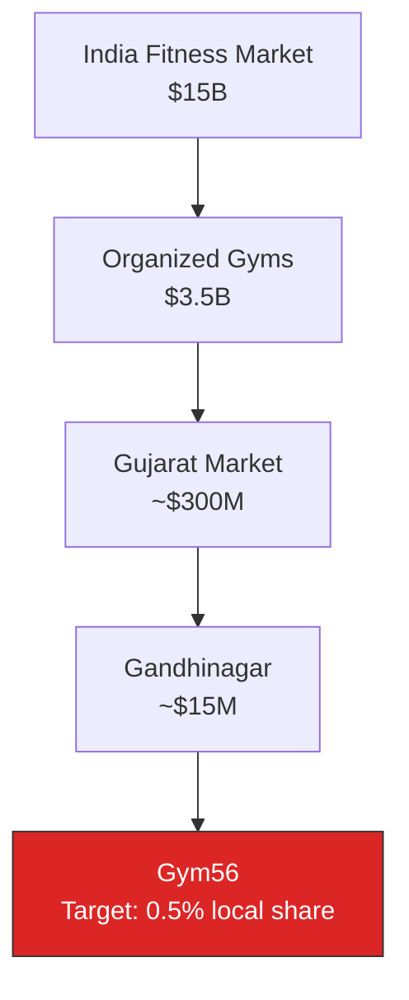
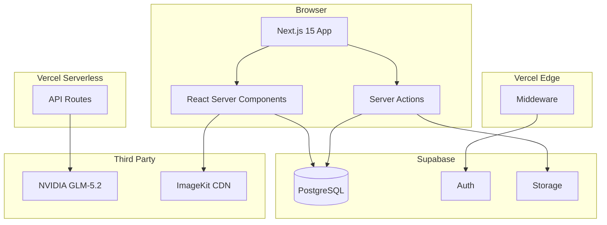

# Product Requirements Document — Gym56

| Metadata | Value |
|----------|-------|
| **Product** | Gym56 |
| **Status** | v1.0.0 (Production) |
| **Author** | Chief Product Officer |
| **Date** | 2026-07-08 |
| **Classification** | Internal |

---

## 1. Executive Summary

Gym56 is a premium fitness gym located in Sector 26, Gandhinagar, Gujarat. The digital product is a full-stack web application that serves as the gym's marketing website, member portal, exercise encyclopedia, and AI-powered fitness coach. It replaces traditional brochure websites with an interactive platform that drives membership signups, engages existing members, and establishes Gym56 as the authority in fitness education in the region.

The platform combines a public-facing marketing site (equipment showcase, 900+ exercise library, fitness calculators) with a private member dashboard and admin panel for gym staff. An AI Coach (powered by NVIDIA GLM-5.2) provides personalized fitness guidance. All content is statically prerendered for performance, with real-time features handled via server actions and streaming.

---

## 2. Vision

To become the digital home of every fitness journey in Gujarat — where Gym56 is not just a place to work out, but the go-to platform for exercise knowledge, AI-powered coaching, and community-driven fitness.

---

## 3. Mission

Democratize access to professional fitness knowledge by combining a world-class exercise encyclopedia, AI coaching, and a premium gym experience into a single, accessible platform that serves both members and the broader fitness community.

---

## 4. Business Goals

| # | Goal | Metric | Timeline |
|---|------|--------|----------|
| BG1 | Increase membership inquiries via digital channels | Contact form submissions ≥ 50/month | Month 3 |
| BG2 | Establish Gym56 as the #1 fitness knowledge resource in Gujarat | 10,000 monthly organic search visitors | Month 6 |
| BG3 | Reduce admin overhead for gym staff | 80% of equipment/exercise management self-served via admin panel | Month 3 |
| BG4 | Drive member retention through digital engagement | Member dashboard login rate ≥ 60% monthly | Month 6 |
| BG5 | Generate ancillary revenue via AI Coach upsells | 15% of active members use AI Coach weekly | Month 6 |
| BG6 | Achieve Lighthouse score ≥ 90 on all categories | Performance, Accessibility, SEO, Best Practices | Month 1 |

---

## 5. Market Opportunity



- **India Fitness Market:** $15 billion (2026), growing at 14% CAGR
- **Organized Gym Segment:** $3.5 billion, with 60% in top 8 cities
- **Gujarat Market:** ~$300 million, driven by Ahmedabad, Surat, Vadodara, Rajkot
- **Gandhinagar Gap:** No premium gym with a digital-first experience exists in the capital city
- **Digital Opportunity:** 80% of gym prospects research online before visiting; Gym56's exercise library + AI Coach creates organic discovery

---

## 6. Target Audience

### Primary — Potential Members

| Persona | Demographics | Pain Point | Gym56 Solution |
|---------|-------------|------------|----------------|
| Young professionals | 22–35, dual-income, Gandhinagar/Ahmedabad | No time for research, want result-driven guidance | AI Coach, quick workout generator |
| Health beginners | 25–40, parents, post-pandemic health focus | Intimidated by gym equipment | Exercise encyclopedia with GIFs, difficulty levels |
| Fitness enthusiasts | 18–30, students, early career | Plateau in results, need variety | 900+ exercise library, comparison tool |

### Secondary — Digital Audience

| Persona | Need | Gym56 Value |
|---------|------|-------------|
| Fitness content consumers | Free, high-quality exercise knowledge | Open exercise encyclopedia (SEO-optimized), AI Coach |
| Local prospects | Gym information, pricing, location | Services page, Google Maps, WhatsApp click-to-chat |

---

## 7. User Personas

### Persona 1: Arjun — The Young Professional

| Attribute | Detail |
|-----------|--------|
| **Age** | 28 |
| **Occupation** | Software Engineer at a Gandhinagar IT company |
| **Fitness Level** | Intermediate — worked out in college, restarting after 2-year gap |
| **Goals** | Build muscle, improve posture, relieve desk-job back pain |
| **Tech Comfort** | High — uses apps for everything |
| **Pain Points** | Forgets proper form, overwhelmed by conflicting advice online |
| **Gym56 Touchpoints** | Exercise encyclopedia (form reference), AI Coach (personalized plan), equipment library (what to use) |

### Persona 2: Kavita — The Health Beginner

| Attribute | Detail |
|-----------|--------|
| **Age** | 34 |
| **Occupation** | Homemaker, mother of two |
| **Fitness Level** | Beginner — never stepped into a gym |
| **Goals** | Lose postpartum weight, get toned, improve energy |
| **Tech Comfort** | Medium — uses WhatsApp, Instagram |
| **Pain Points** | Embarrassed about not knowing equipment, afraid of injury |
| **Gym56 Touchpoints** | Exercise difficulty labels (beginner filter), safety tips per exercise, AI Coach (non-judgmental guidance) |

### Persona 3: Rajesh — The Gym Owner / Admin

| Attribute | Detail |
|-----------|--------|
| **Age** | 45 |
| **Occupation** | Gym56 Owner |
| **Fitness Level** | Experienced, but focused on business |
| **Goals** | Manage equipment inventory, update exercise content, track member engagement |
| **Tech Comfort** | Low — prefers simple interfaces |
| **Gym56 Touchpoints** | Admin panel (equipment CRUD, exercise CRUD, contact inbox) |

### Persona 4: Dhruv — The Fitness Enthusiast

| Attribute | Detail |
|-----------|--------|
| **Age** | 22 |
| **Occupation** | College student |
| **Fitness Level** | Advanced — 4+ years of consistent training |
| **Goals** | Break through plateaus, try new exercise variations |
| **Tech Comfort** | High — follows fitness influencers online |
| **Pain Points** | Boredom with same routine, wants science-based training |
| **Gym56 Touchpoints** | Full exercise library (900+), comparison tool, AI Coach (advanced programming) |

---

## 8. Pain Points

| # | Pain Point | Severity | Gym56 Solution |
|---|-----------|----------|----------------|
| P1 | No single source of truth for exercise form | High | Exercise encyclopedia with step-by-step instructions, targeted muscles, common mistakes |
| P2 | Gym newcomers feel intimidated | High | Difficulty labels, beginner-friendly content, AI Coach for private Q&A |
| P3 | Admin overhead for equipment/exercise updates | High | Admin CRUD panel — no developer needed |
| P4 | Potential members can't visualize the gym online | Medium | Equipment showcase with GIFs, facility images, Google Maps |
| P5 | No way to get quick fitness answers after hours | Medium | AI Coach available 24/7 |
| P6 | Contact forms get lost in email | Low | Centralized contact inbox in admin panel |

---

## 9. Competitive Analysis

| Competitor | Strength | Weakness | Gym56 Advantage |
|-----------|----------|----------|-----------------|
| **Cult.fit** | Brand, app ecosystem, live classes | National focus, no local gym feel | Local Gandhinagar gym + digital experience |
| **ExerciseDB (API)** | 900+ exercises with GIFs | No AI coaching, no gym context | AI Coach + integrated with local gym |
| **FitBudd / Kwench** | All-in-one gym management SaaS | Generic, expensive for small gyms | Built specifically for Gym56, custom AI Coach |
| **Google "gym near me"** | Zero effort discovery | No depth, no engagement | Rich exercise library, AI Coach creates stickiness |
| **Traditional gym websites** | Simple to build | Static brochure, no interactivity | Dynamic encyclopedia, member portal, AI |

**Defensible Moat:** Local-first (Gandhinagar), AI-powered coaching, 900+ exercise encyclopedia, custom-built for Gym56's brand and equipment. Competitors are either national (no local feel), generic SaaS (no custom AI), or static brochures (no interactivity).

---

## 10. Functional Requirements

### FR1 — Marketing Website

| ID | Requirement | Priority | Notes |
|----|------------|----------|-------|
| FR1.1 | Hero section with gym branding, tagline, and CTA | P0 | Floating equipment PNGs |
| FR1.2 | Equipment carousel with ExerciseDB GIF thumbnails | P0 | ImageKit CDN |
| FR1.3 | Features/benefits section (AC, trainers, equipment) | P0 | |
| FR1.4 | Trainer showcase with bios | P0 | |
| FR1.5 | Testimonials / transformation stories | P0 | |
| FR1.6 | FAQ accordion | P1 | |
| FR1.7 | Contact form (name, email, phone, message) | P0 | Saved to Supabase |
| FR1.8 | Google Maps embed with location | P0 | |
| FR1.9 | Services / membership pricing page | P0 | |
| FR1.10 | About page with gym story | P1 | |

### FR2 — Equipment Library

| ID | Requirement | Priority | Notes |
|----|------------|----------|-------|
| FR2.1 | Equipment catalog with 25+ items | P0 | Stored in Supabase |
| FR2.2 | Equipment detail page with description, usage tips | P0 | SSG with `generateStaticParams` |
| FR2.3 | Each equipment card shows related exercises with GIFs | P0 | ExerciseDB images |
| FR2.4 | Equipment category filter | P1 | |
| FR2.5 | Equipment condition / availability indicators | P2 | |

### FR3 — Exercise Encyclopedia

| ID | Requirement | Priority | Notes |
|----|------------|----------|-------|
| FR3.1 | Exercise library with 900+ entries | P0 | ExerciseDB data |
| FR3.2 | Exercise detail page with full instructions | P0 | Steps, tips, mistakes |
| FR3.3 | Filter by muscle group, category, difficulty | P0 | Client-side |
| FR3.4 | Search by name | P0 | |
| FR3.5 | Related exercises section | P1 | |
| FR3.6 | Exercise comparison tool | P2 | |

### FR4 — AI Coach

| ID | Requirement | Priority | Notes |
|----|------------|----------|-------|
| FR4.1 | Streaming chat interface (SSE) | P0 | NVIDIA GLM-5.2 |
| FR4.2 | Suggested prompt buttons (workout, nutrition, form) | P0 | |
| FR4.3 | Copy response to clipboard | P0 | |
| FR4.4 | Regenerate response | P0 | |
| FR4.5 | Stop generation mid-stream | P0 | AbortController |
| FR4.6 | Message persistence via localStorage | P0 | |
| FR4.7 | Not-connected state when API key missing | P0 | WifiOff icon |
| FR4.8 | Clear chat button | P1 | |

### FR5 — Member Dashboard

| ID | Requirement | Priority | Notes |
|----|------------|----------|-------|
| FR5.1 | Login with email/password | P0 | Supabase Auth |
| FR5.2 | Subscription overview (plan, expiry, status) | P0 | |
| FR5.3 | Profile editing (name, phone, avatar) | P0 | Avatar upload to Supabase storage |
| FR5.4 | Dashboard overview with stats | P1 | |

### FR6 — Admin Panel

| ID | Requirement | Priority | Notes |
|----|------------|----------|-------|
| FR6.1 | Admin layout (sidebar + header) | P0 | |
| FR6.2 | Equipment CRUD (create, read, update, delete) | P0 | With image upload |
| FR6.3 | Exercise CRUD | P0 | With steps, tips, images |
| FR6.4 | Contact inbox (read, mark read, delete) | P0 | |
| FR6.5 | Membership plan management | P2 | Not yet implemented |
| FR6.6 | Member management (view profiles, add subscriptions) | P2 | Not yet implemented |
| FR6.7 | Gallery management | P2 | |
| FR6.8 | FAQ management | P2 | |
| FR6.9 | Analytics dashboard | P2 | |

### FR7 — Fitness Tools

| ID | Requirement | Priority | Notes |
|----|------------|----------|-------|
| FR7.1 | BMR / TDEE calculator | P1 | |
| FR7.2 | 1RM calculator | P1 | |
| FR7.3 | Macro calculator | P1 | |
| FR7.4 | BMI calculator | P1 | |
| FR7.5 | Calorie calculator | P1 | |

---

## 11. Non-Functional Requirements

| ID | Requirement | Target | Measurement |
|----|------------|--------|-------------|
| NFR1 | Mobile-first responsive design | All pages usable at 320px width | Manual responsive testing |
| NFR2 | Page load < 3s on 3G | Largest Contentful Paint ≤ 3s | Lighthouse |
| NFR3 | 99.5% uptime for core pages | Public site available 99.5% of the time | Vercel status + uptime monitoring |
| NFR4 | Lighthouse score ≥ 90 | Performance, Accessibility, SEO, Best Practices | Lighthouse CI |
| NFR5 | Accessible (WCAG 2.1 AA) | No automated aXe violations | jest-axe |
| NFR6 | Dark theme only | Consistent dark UI across all pages | Visual audit |
| NFR7 | Stream AI responses in < 3s (TTFB after warm) | Time to first streaming token | Manual measurement |

---

## 12. User Stories

### Epic 1: Prospect Discovers Gym56

| ID | Story | Acceptance Criteria |
|----|-------|-------------------|
| US1 | As a prospect, I want to browse the equipment library so I can see what the gym offers | Equipment list loads with images, category filter works |
| US2 | As a prospect, I want to search exercises so I can find specific workouts | Search returns relevant results within 2s |
| US3 | As a prospect, I want to use the AI Coach so I can get fitness advice without visiting | AI responds in real-time with streaming output |
| US4 | As a prospect, I want to contact the gym so I can inquire about membership | Form submits successfully; admin sees it in inbox |

### Epic 2: Member Uses AI Coach

| ID | Story | Acceptance Criteria |
|----|-------|-------------------|
| US5 | As a member, I want to ask fitness questions and get streaming answers | SSE stream renders progressively, stop works |
| US6 | As a member, I want to copy AI responses | Clipboard API copies correctly |
| US7 | As a member, I want to regenerate responses | Previous response replaced, new stream starts |

### Epic 3: Admin Manages Content

| ID | Story | Acceptance Criteria |
|----|-------|-------------------|
| US8 | As an admin, I want to add/edit/delete equipment | CRUD operations persist to DB, UI updates |
| US9 | As an admin, I want to manage exercises including steps | Steps have order, can be reordered |
| US10 | As an admin, I want to view and respond to contact inquiries | Inbox shows submissions, read/unread state toggles |

### Epic 4: Member Manages Profile

| ID | Story | Acceptance Criteria |
|----|-------|-------------------|
| US11 | As a member, I want to view my membership details | Plan name, expiry date, status visible |
| US12 | As a member, I want to edit my profile and upload an avatar | Changes persist, images render correctly |

---

## 13. Acceptance Criteria (Cross-Cutting)

| # | Criteria | Verification |
|---|----------|-------------|
| AC1 | All pages render without JavaScript errors | Console check, error boundary test |
| AC2 | All forms validate on submit with clear error messages | Zod validation messages visible |
| AC3 | All interactive elements are keyboard-accessible | Tab through entire page |
| AC4 | All API routes return correct status codes | 200/404/500 as appropriate |
| AC5 | All Server Actions return `{ success: true/false }` shape | Consistent response format |
| AC6 | AI Coach shows "not connected" state when API key is missing | UI renders correctly |
| AC7 | Admin routes redirect to login when session is missing | Middleware enforces auth |
| AC8 | 404 page renders for unknown routes | Custom not-found.tsx |

---

## 14. KPIs

### Business

| KPI | Target | Measurement |
|-----|--------|-------------|
| Contact form submissions | ≥ 50/month | Supabase `contact_submissions` count |
| AI Coach conversations | ≥ 100/month | LocalStorage event tracking (planned) |
| Member dashboard logins | ≥ 60% monthly actives | Supabase auth events |
| Organic search traffic | 10,000 monthly visits | Vercel Analytics |
| Equipment/exercise page views | ≥ 5,000/month | Vercel Analytics |

### Performance

| KPI | Target | Measurement |
|-----|--------|-------------|
| LCP | < 2.5s | Vercel Speed Insights |
| CLS | < 0.1 | Vercel Speed Insights |
| INP | < 200ms | Vercel Speed Insights |
| First byte (SSR) | < 500ms | Vercel Speed Insights |

### Engagement

| KPI | Target | Measurement |
|-----|--------|-------------|
| Pages per session | ≥ 3 | Vercel Analytics |
| Bounce rate | < 40% | Vercel Analytics |
| AI Coach return rate | ≥ 20% within 7 days | localStorage with timestamp |

---

## 15. MVP Scope

```mermaid
graph TD
    subgraph MVP — Complete (v1.0.0)
        A[Marketing Site] --> A1[Homepage with Hero & Equipment]
        A --> A2[About / Services / Contact]
        A --> A3[Equipment Library 25+]
        A --> A4[Exercise Encyclopedia 900+]
        
        B[AI Coach] --> B1[Streaming Chat]
        B --> B2[Copy / Regenerate / Stop]
        B --> B3[Not-Connected State]
        
        C[Auth & Members] --> C1[Login / Signup]
        C --> C2[Member Dashboard]
        C --> C3[Profile Management]
        
        D[Admin Panel] --> D1[Equipment CRUD]
        D --> D2[Exercise CRUD]
        D --> D3[Contact Inbox]
        D --> D4[Gallery / FAQs / Articles / Announcements / Analytics / Settings / Testimonials]
        
        E[Infrastructure] --> E1[Supabase DB + Auth]
        E --> E2[Vercel Deployment]
        E --> E3[PWA + Offline]
        E --> E4[SEO + JSON-LD]
        E --> E5[Analytics]
    end
    
    style MVP fill:#DC2626,stroke:#333,color:#fff
```

| Feature | Effort | Status |
|---------|--------|--------|
| Marketing site (homepage, about, services, contact) | 3 weeks | ✅ Live |
| Equipment library with ExerciseDB images | 2 weeks | ✅ Live |
| Exercise encyclopedia (900+ exercises) | 4 weeks | ✅ Live |
| AI Coach with streaming (NVIDIA GLM-5.2) | 2 weeks | ✅ Live |
| Member auth + dashboard + profile | 3 weeks | ✅ Live |
| Admin panel (equipment, exercises, contact, content) | 4 weeks | ✅ Live |
| PWA + SEO + Analytics | 1 week | ✅ Live |
| Fitness calculators (BMR, 1RM, macro, BMI, calorie) | 1 week | ✅ Live |
| Security (middleware, RLS, JWT role check, HSTS) | 1 week | ✅ Live |

**Total: 21 weeks (4 sprints) — All complete.**

---

## 16. Phase 2 — Enhancements

| Feature | Description | Priority |
|---------|-------------|----------|
| **Online membership booking & payment** | Razorpay/Stripe integration for digital signups | High |
| **Workout logging & history** | Members log sets/reps, track progress over time | High |
| **Class booking system** | Reserve slots for group classes (Zumba, Yoga, HIIT) | High |
| **Trainer appointment scheduling** | Book 1:1 sessions with specific trainers | Medium |
| **Push notifications** | Workout reminders, membership expiry alerts | Medium |
| **Community feed** | Members share progress, photos, achievements | Medium |
| **Nutrition meal planner** | AI-generated meal plans with Indian cuisine options | Medium |
| **Wearable integration** | Sync steps, HR, sleep from Apple Watch / Fitbit | Low |
| **Multi-language support** | Gujarati, Hindi UI | Low |
| **Mobile app (React Native)** | Native mobile experience for members | Low |

---

## 17. Risks

| Risk | Likelihood | Impact | Mitigation |
|------|------------|--------|------------|
| NVIDIA API cold start latency (60-90s) | High | Medium | Warm-up cron job; UI shows "waking up AI" state |
| NVIDIA API deprecation / downtime | Low | High | Abstract model behind env var; can swap to any OpenAI-compatible endpoint |
| Supabase free tier limits | Medium | Medium | Monitor usage; upgrade plan before hitting limits |
| ExerciseDB image CDN goes down | Low | High | Store fallback images in Supabase storage |
| AI hallucination / incorrect fitness advice | Medium | Medium | System prompt disclaims medical advice; "consult a trainer" caveat |
| ESLint/TypeScript build failures | Low | Medium | Fix lint errors before deploy; maintain strict mode |
| Sensitive data exposure via service_role | Low | High | Never expose service_role client to browser; use only in Server Actions |

---

## 18. Constraints

| # | Constraint | Impact |
|---|-----------|--------|
| C1 | Single developer team | Development velocity limited; prioritization critical |
| C2 | Supabase free tier limits (500 MB DB, 2 GB bandwidth) | Need to cache assets, optimize queries, monitor usage |
| C3 | Vercel serverless function timeout (60s for Hobby, 900s for Pro) | AI streaming must work within timeout; cold start mitigation |
| C4 | No budget for paid tools/APIs (except NVIDIA) | Stick to free tiers of Supabase, Vercel, CDN |
| C5 | Dark theme only | Simplifies design system but limits aesthetic flexibility |

---

## 19. Future Features

| Feature | Description | Target Phase |
|---------|-------------|--------------|
| **Online Payment Gateway** | Razorpay/Stripe for self-serve membership purchase | Phase 2 |
| **Workout Logging** | Members log sets, reps, weight for each exercise | Phase 2 |
| **Class Booking** | Reserve slots for group classes with calendar view | Phase 2 |
| **Trainer Dashboard** | Trainer-specific view with member exercise programs | Phase 2 |
| **Community Features** | Progress sharing, workout of the day, leaderboard | Phase 2 |
| **Favorites / Saved Exercises** | Bookmark exercises for quick access | Phase 2 |
| **Workout Builder** | Multi-step form → AI-generated custom workout plan | Phase 2 |
| **Settings Page** | Password change, theme toggle, account deletion | Phase 2 |
| **Gujarati / Hindi i18n** | Full multi-language support | Phase 2 |
| **Mobile App** | React Native app for Apple/Android stores | Phase 3 |

---

## 20. Appendix: System Architecture

### 20.1 High-Level Architecture



### 20.2 Data Flow

```
Public User: Browser → RSC → Supabase (anon, RLS enforced) → Rendered HTML
Admin User:  Browser → Server Action (Zod validate) → Supabase (service_role) → Response
AI Coach:    Browser → API Route → NVIDIA SSE stream → Browser renders progressively
```
