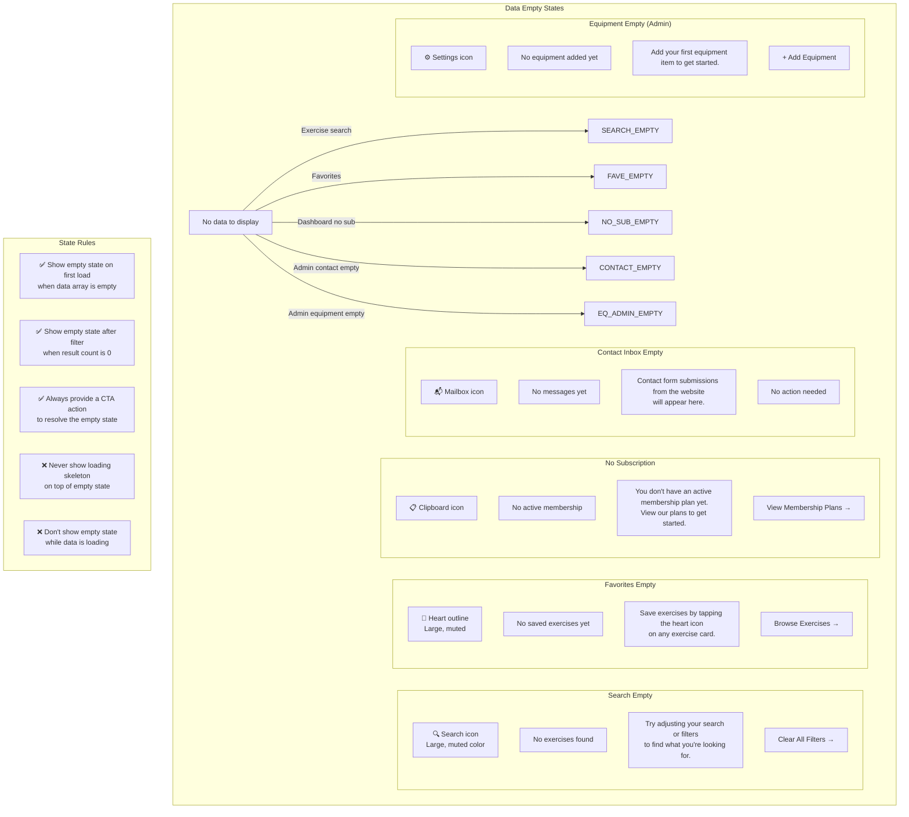

# User Flows — Gym56

| Metadata | Value |
|----------|-------|
| **Product** | Gym56 — Premium Fitness |
| **Author** | Senior Product Designer |
| **Version** | v1.0.0 (reflects actual codebase) |
| **Diagrams** | Mermaid.js |

---

## 1. Landing → Homepage

**Goal:** Convert a first-time visitor into an engaged prospect who explores equipment, exercises, or contacts the gym.

```mermaid
graph TB
    START([Visitor arrives<br/>at gym56.vercel.app]) --> HERO[Hero Section]
    
    HERO -->|Click "Explore Equipment"| EQ[Equipment Page]
    HERO -->|Click "View Exercises"| EX[Exercise Page]
    HERO -->|Click "Join Now"| SIGNUP[Signup Page]
    HERO -->|Scroll ↓| FEATURES[Features Section]
    
    FEATURES -->|Scroll ↓| CAROUSEL[Equipment Carousel<br/>with exercise GIFs]
    CAROUSEL -->|Click equipment card| EQ_DETAIL[Equipment Detail Page]
    
    FEATURES -->|Scroll ↓| TRAINERS[Trainer Showcase]
    TRAINERS -->|Scroll ↓| TESTIMONIALS[Testimonial Cards]
    TESTIMONIALS -->|Scroll ↓| CTA[Call to Action<br/>"Start Your Journey"]
    
    CTA -->|Click "Join Now"| SIGNUP
    CTA -->|Click "View Pricing"| SERVICES[Services / Pricing Page]
    
    NAVBAR[Navbar<br/>Always visible at top] -->|Logo| HERO
    NAVBAR -->|About| ABOUT[About Page]
    NAVBAR -->|Services| SERVICES
    NAVBAR -->|Equipment| EQ
    NAVBAR -->|Exercises| EX
    NAVBAR -->|AI Coach| AI_COACH[AI Coach Page]
    NAVBAR -->|Contact| CONTACT[Contact Page]
    NAVBAR -->|Login| LOGIN[Login Page]
    NAVBAR -->|Mobile: hamburger menu| DRAWER[Mobile Slide-out Menu]
    DRAWER -->|Same links as navbar| HERO
    
    FOOTER[Footer] -->|Google Maps link| MAPS[Google Maps<br/>in new tab]
    FOOTER -->|Instagram| INSTA[Instagram<br/>in new tab]
    FOOTER -->|Phone: +91 94294 21772| CALL[Phone Dialer]
    FOOTER -->|Email| CONTACT
    FOOTER -->|Quick Links| All pages
    
    START -->|Scroll directly to section| URL_HASH[URL Hash Links<br/>e.g., /#features, /#equipment]
```

### Screen-by-Screen Breakdown

**Hero Section**
- **Layout:** Full-viewport dark background with floating equipment PNGs (dumbbell, bench press, cable crossover, lat pulldown, bicep curl) animated with Framer Motion float effect
- **Headline:** "Transform Your Body, Transform Your Life" (60px, font-extrabold)
- **Subheadline:** "Premium fitness gym in Sector 26, Gandhinagar. World-class equipment, expert trainers, AI-powered coaching."
- **CTAs:**
  - `[Explore Equipment]` → navigates to `/equipment` (primary button)
  - `[View Exercises]` → navigates to `/exercises` (secondary button)
- **Scroll indicator:** Gentle bounce animation at bottom center

**Features Section** (`#features`)
- **Layout:** 2-column grid on desktop, stacked on mobile
- **Cards:** Glass morphism cards with icon + title + description
- **Features:** Modern Equipment, Expert Trainers, AC Facility, AI Coach, Exercise Library, Community
- **Interaction:** Cards stagger-in on scroll (Framer Motion)

**Equipment Carousel**
- **Layout:** Horizontal scrollable row with arrow navigation
- **Cards:** Each shows equipment name + ExerciseDB exercise thumbnail GIF
- **Interaction:** Click → `/equipment/{slug}` detail page

**Navbar**
- **Desktop:** Logo (left) | nav links (center) | Login button (right). Sticky, glass background on scroll
- **Mobile (< 768px):** Logo (left) | hamburger icon (right) → slide-out drawer from right with all links
- **States:** Default (transparent), Scrolled (glass background), Active page (accent underline)

**Footer**
- **Layout:** 3-column grid: Gym56 info | Quick Links | Contact
- **Google Maps:** `https://maps.app.goo.gl/fC3iHyTbnKSci16t5` — opens in new tab
- **Phone:** `+91 94294 21772` — `tel:` link on mobile
- **Instagram:** Opens in new tab

---

## 2. Authentication

**Goal:** Allow users to sign up, log in, and recover their accounts securely.

```mermaid
graph TB
    START([User needs to authenticate]) --> LOGIN[Login Page<br/>/login]
    
    LOGIN -->|Enter email + password| VALIDATE{Validate}
    VALIDATE -->|Success| DASHBOARD[Redirect to Dashboard<br/>or previous protected page]
    VALIDATE -->|Invalid credentials| LOGIN_ERROR[Show error toast<br/>"Invalid email or password"]
    LOGIN_ERROR --> LOGIN
    
    LOGIN -->|Click "Sign Up"| SIGNUP[Sign Up Page<br/>/signup]
    LOGIN -->|Click "Forgot Password"| FORGOT[Forgot Password Page<br/>/forgot-password]
    LOGIN -->|Click "Continue with Google"| GOOGLE_OAUTH[Google OAuth flow]
    
    GOOGLE_OAUTH -->|Success| DASHBOARD
    GOOGLE_OAUTH -->|Error| LOGIN_ERROR
    
    SIGNUP -->|Enter email + password + confirm| SIGNUP_VALIDATE{Validate}
    SIGNUP_VALIDATE -->|Success| REDIRECT_SIGNUP[Redirect to Dashboard]
    SIGNUP_VALIDATE -->|Password weak| PW_ERROR[Show "Password must be 6+ characters"]
    SIGNUP_VALIDATE -->|Email taken| EMAIL_ERROR[Show "Email already registered"]
    SIGNUP_VALIDATE -->|Passwords don't match| MATCH_ERROR[Show "Passwords do not match"]
    PW_ERROR --> SIGNUP
    EMAIL_ERROR --> SIGNUP
    MATCH_ERROR --> SIGNUP
    
    SIGNUP -->|Click "Login"| LOGIN
    SIGNUP -->|Click "Continue with Google"| GOOGLE_OAUTH
    
    FORGOT -->|Enter email| SEND_RESET[Send reset email via Supabase]
    SEND_RESET -->|Success| CHECK_EMAIL[Show success toast<br/>"Check your email for reset link"]
    SEND_RESET -->|Email not found| FORGOT_ERROR[Show "No account with this email"]
    FORGOT_ERROR --> FORGOT
    
    CHECK_EMAIL -->|User clicks email link| RESET_PAGE[Reset Password Page<br/>/reset-password]
    RESET_PAGE -->|Enter new password + confirm| RESET_VALIDATE{Validate}
    RESET_VALIDATE -->|Success| RESET_SUCCESS[Redirect to login<br/>Show success toast "Password reset"]
    RESET_VALIDATE -->|Error| RESET_ERROR[Show error toast]
    RESET_ERROR --> RESET_PAGE
    
    LOGIN -->|Already logged in| MID_REDIRECT[Middleware redirects to /]
    
    subgraph "Protected Route Attempt"
        PROTECTED[User visits /dashboard<br/>or /admin] --> MIDDLEWARE{Session cookie exists?}
        MIDDLEWARE -->|No| REDIRECT_LOGIN[Redirect to /login?redirectTo=/dashboard]
        REDIRECT_LOGIN --> LOGIN
        MIDDLEWARE -->|Yes, valid| ACCESS[Grant access]
    end
```

### Screen-by-Screen Breakdown

**Login Page** (`/login`)
- **Layout:** Centered card (max-width 420px) with Gym56 logo at top
- **Fields:** Email (input with email validation), Password (input with show/hide toggle)
- **Actions:**
  - `[Log In]` (primary button, full width) — validates via Supabase Auth
  - `[Continue with Google]` (secondary button with Google icon)
  - `[Forgot Password?]` (text link) → `/forgot-password`
  - `[Don't have an account? Sign up]` (text link) → `/signup`
- **Error states:** Inline error on email (invalid format), inline on password (wrong), general error toast for server errors
- **Loading state:** Button shows spinner, all fields disabled
- **Post-login redirect:**
  - If `redirectTo` param exists → navigate to that URL
  - If user role is `ADMIN` → `/admin`
  - Otherwise → `/dashboard`

**Sign Up Page** (`/signup`)
- **Layout:** Same centered card pattern as login
- **Fields:** Full Name, Email, Password (with strength indicator), Confirm Password
- **Strength indicator:** 4-segment bar (empty → weak → medium → strong) based on length + complexity
- **Actions:**
  - `[Create Account]` (primary button) — creates user via Supabase Auth, trigger creates profile row
  - `[Continue with Google]` (secondary button)
  - `[Already have an account? Log in]` → `/login`
- **Success:** Redirect to `/dashboard` with welcome toast

**Forgot Password Page** (`/forgot-password`)
- **Layout:** Minimal centered card, single field
- **Field:** Email
- **Action:** `[Send Reset Link]` — calls Supabase `resetPasswordForEmail()`
- **Success:** Toast "Check your email" + back-to-login link
- **Error:** Toast if email not found

**Reset Password Page** (`/reset-password`)
- **Accessible only via:** Magic link from email (Supabase type=recovery)
- **Fields:** New Password (with strength), Confirm Password
- **Action:** `[Reset Password]` — calls Supabase `updateUser()`
- **Success:** Toast + redirect to login
- **Error:** Token expired → toast "Link expired, request a new one" + link to `/forgot-password`

---

## 3. Dashboard

**Goal:** Give members a clear overview of their gym membership status and quick access to key features.

```mermaid
graph TB
    LOGIN([User logs in]) --> DASH[Member Dashboard<br/>/dashboard]
    
    DASH -->|View| OVERVIEW[Overview Panel]
    DASH -->|Click| PROFILE[Profile Page<br/>/dashboard/profile]
    DASH -->|Click| AI_COACH[AI Coach<br/>/ai-coach]
    DASH -->|Click| EXERCISES[Exercise Library<br/>/exercises]
    
    subgraph "Overview Panel"
        GREETING[Welcome Back, {Name}!]
        SUB_STATUS[Subscription Status Card]
        QUICK_LINKS[Quick Links Grid]
        RECENT[Recent Activity / Tips]
    end
    
    SUB_STATUS -->|Active subscription| ACTIVE[Show plan name<br/>Expiry date<br/>Days remaining<br/>Green badge "Active"]
    SUB_STATUS -->|No subscription| NO_SUB[Show "No active plan"<br/>CTA: "View Membership Plans"]
    SUB_STATUS -->|Expiring within 7 days| EXPIRING[Same as active +<br/>Yellow warning badge<br/> "Expiring Soon"]
    SUB_STATUS -->|Expired| EXPIRED[Show "Subscription Expired"<br/>CTA: "Renew Now"]
    
    ACTIVE -->|Click plan card| MEMBERSHIPS[Membership Plans Page<br/>for upgrade options]
    NO_SUB -->|Click "View Plans"| MEMBERSHIPS
    EXPIRED -->|Click "Renew Now"| MEMBERSHIPS
    
    QUICK_LINKS -->|AI Coach| AI_COACH
    QUICK_LINKS -->|Exercise Library| EXERCISES
    QUICK_LINKS -->|Edit Profile| PROFILE
    QUICK_LINKS -->|Fitness Tools| TOOLS[Tools /calculators]
    
    NAV_TOP[Dashboard top nav] -->|Profile icon dropdown| DROPDOWN[Dropdown Menu]
    DROPDOWN -->|Admin Panel| ADMIN[Admin Panel] 
    DROPDOWN -->|Logout| LOGOUT[Sign out → redirect to /]
    
    DROPDOWN -->|Admin link shown only if role=ADMIN| ADMIN
    
    style ADMIN fill:#DC2626,stroke:#333,color:#fff
    style AI_COACH fill:#DC2626,stroke:#333,color:#fff
```

### Screen-by-Screen Breakdown

**Overview Panel**
- **Greeting:** "Welcome back, {full_name}!" — with avatar circle (or initials fallback)
- **Subscription Card:** Glass card with:
  - Plan name (e.g., "Yearly Membership")
  - Status badge: green "Active", yellow "Expiring Soon", red "Expired", gray "No Plan"
  - Date range: "Valid until Dec 31, 2026"
  - Days remaining: "156 days left" (large number, count-up animation)
  - `[View Plans]` or `[Renew]` button
- **Quick Links Grid:** 2×2 grid of icon cards (AI Coach, Exercises, Profile, Tools)
- **Recent Activity:** Tips or motivational quote from AI Coach (if user has used it)

**Admin Link Visibility**
- Link only appears in dropdown if `user.user_metadata.user_role === 'ADMIN'`
- Trainers see a "Trainer Panel" link instead

---

## 4. Exercise Search

**Goal:** Let users quickly find any exercise from 900+ database and learn proper form.

```mermaid
graph TB
    START([User navigates to<br/>/exercises]) --> EX_LIST[Exercise Library Page]
    
    EX_LIST -->|View| GRID[Exercise Grid<br/>Auto-fill cards, 3-col desktop]
    EX_LIST -->|Type in search bar| SEARCH[Search Input]
    EX_LIST -->|Select filter| FILTERS[Filter Panel]
    EX_LIST -->|Click Sort| SORT[Sort Dropdown]
    
    SEARCH -->|Debounced 300ms| RESULTS[Filtered results<br/>Full-text search on name + muscles]
    SEARCH -->|Clear X| GRID
    
    FILTERS -->|By Muscle Group| MUSCLE[Dropdown: Chest, Back, Legs, Shoulders, Arms, Core, Full Body]
    FILTERS -->|By Category| CAT[Dropdown: Strength, Cardio, Stretching]
    FILTERS -->|By Difficulty| DIFF[Dropdown: Beginner, Intermediate, Advanced]
    FILTERS -->|By Equipment| FILTER_EQ[Dropdown: Barbell, Dumbbell, Cable, Machine, Bodyweight]
    FILTERS -->|"Clear All"| GRID
    
    FILTERS -->|Mobile: Tap filter icon| FILTER_DRAW[Mobile Filter Drawer<br/>Slides up from bottom]
    FILTER_DRAW -->|Apply| RESULTS
    FILTER_DRAW -->|Close| GRID
    
    SORT -->|Name A-Z| RESULTS
    SORT -->|Name Z-A| RESULTS
    SORT -->|Difficulty (Easy first)| RESULTS
    
    GRID -->|Click exercise card| EX_DETAIL[Exercise Detail Page<br/>/exercise/{slug}]
    RESULTS -->|Click exercise card| EX_DETAIL
    
    subgraph "Exercise Card"
        CARD_IMG[Exercise GIF thumbnail<br/>from ImageKit CDN]
        CARD_NAME[Exercise Name]
        CARD_MUSCLE[Target Muscle Tag<br/>Badge component]
        CARD_DIFF[Difficulty Badge]
    end
    
    EX_DETAIL -->|View| DETAIL_LAYOUT[Detail Layout]
    
    subgraph "Detail Layout"
        LEFT[Left Column]
        RIGHT[Right Column]
    end
    
    LEFT -->|Image| MAIN_IMG[Primary image<br/>+ thumbnail gallery]
    LEFT -->|Video link| VIDEO[Video URL<br/>Opens in new tab]
    
    RIGHT --> TITLE[Exercise Name (h1)]
    RIGHT --> TAGS[Category · Muscle · Difficulty · Force<br/>Badge row]
    RIGHT --> INSTRUCTIONS[Step-by-step instructions<br/>Numbered list]
    RIGHT --> TIPS[Pro Tips<br/>Bullet list with lightbulb icon]
    RIGHT --> MISTAKES[Common Mistakes<br/>Bullet list with X icon]
    RIGHT --> BREATHING[Breathing Guide<br/>Quote-style card]
    RIGHT --> PROGRESSIONS[Progressions<br/>Numbered list with arrow-up icon]
    RIGHT --> REGRESSIONS[Regressions<br/>Numbered list with arrow-down icon]
    RIGHT --> ALTERNATIVES[Related Exercises<br/>Small cards grid, 3-col]
    RIGHT --> SHARE[Share Button<br/>Copy link to clipboard]
    
    ALTERNATIVES -->|Click related| EX_DETAIL
    
    SHARE -->|Copied| TOAST[Toast: "Link copied to clipboard"]
    
    EX_LIST -->|Back button| EX_LIST
    EX_DETAIL -->|Exercises nav| EX_LIST
    
    subgraph "Empty State"
        NO_RESULTS[No exercises found]
        NO_RESULTS_CTA["Try different search terms<br/>or clear filters"]
        NO_RESULTS -->|Clear Filters| GRID
    end
    
    subgraph "Error State"
        EX_ERROR["Failed to load exercises"]
        EX_ERROR_RETRY[Show retry button]
        EX_ERROR_RETRY -->|Retry| EX_LIST
    end
```

### Screen-by-Screen Breakdown

**Exercise Library** (`/exercises`)
- **Search Bar:** Full-width input at top with search icon. Placeholder: "Search 900+ exercises..." 
- **Filter Bar:** Horizontal row of dropdown filters below search. On mobile, collapses to a single "Filter" button that opens a bottom drawer
- **Result Count:** "Showing {N} of 943 exercises" updating live as filters change
- **Card Grid:** Auto-fill grid `minmax(280px, 1fr)`. Each card:
  - **Thumbnail:** ImageKit CDN image (loading="lazy")
  - **Title:** Exercise name (text-base, font-semibold)
  - **Tags:** Muscle group badge + difficulty badge
  - **Hover:** Subtle lift (Y -4px) + border glow
- **Pagination:** "Load More" button at bottom (infinite scroll disabled for performance)
- **Loading:** Skeleton grid (6 skeleton cards with shimmer animation)
- **Empty:** "No exercises match your filters" with suggestion text and "Clear Filters" button
- **Error:** "Failed to load exercises" with retry button

**Exercise Detail** (`/exercise/{slug}`)
- **Layout:** 2-column on desktop (40% image / 60% content), stacked on mobile
- **Image:** Primary image at top, click to view full size (lightbox)
- **Metadata badges:** Category | Muscle Group | Difficulty | Force (Push/Pull)
- **Instructions:** Numbered list with step-by-step descriptions
- **Tips sections:** Pro Tips (lightbulb icon), Common Mistakes (X icon), Safety Tips (shield icon)
- **Progressions/Regressions:** Arrow indicators showing how to scale up/down
- **Breathing:** Highlighted quote card "Exhale as you push..."
- **Alternatives:** Small card grid of related exercises (same muscle group)
- **Share:** Clipboard copy button with toast confirmation

---

## 5. AI Coach

**Goal:** Provide personalized fitness advice through a chat interface powered by GPT-4o-mini.

```mermaid
graph TB
    START([User navigates to<br/>/ai-coach]) --> CHECK_API{API key configured?}
    
    CHECK_API -->|No| NOT_CONNECTED[Not Connected State<br/>WifiOff icon<br/>"AI Coach is not connected yet."]
    CHECK_API -->|Yes| COACH[AI Coach Chat Interface]
    
    NOT_CONNECTED -->|Info text| EXPLAIN["Please contact the gym<br/>to activate this feature."]
    
    COACH -->|First visit| WELCOME[Welcome Message from AI]
    COACH -->|Has history| HISTORY[Load messages from localStorage]
    
    WELCOME -->|Shows greeting| WELCOME_MSG["Hey! 👋 Welcome to Gym56! I'm your AI Coach..."]
    WELCOME_MSG -->|Followed by| SUGGESTIONS[Suggested Prompts Grid]
    
    SUGGESTIONS -->|6 prompt cards| PROMPTS
    
    subgraph "Suggested Prompts"
        P1["🏋️ Create a push workout"]
        P2["🍎 Pre/post workout nutrition"]
        P3["🧠 Barbell squat form check"]
        P4["❤️ Weekly weight loss plan"]
        P5["♿ Beginner routine"]
        P6["💪 Best approach for muscle gain"]
    end
    
    PROMPTS -->|Click card| SEND
    
    CHAT_AREA[Chat Message List] --> MSG[Message Bubbles]
    
    MSG -->|User messages| USER_BUBBLE[Right-aligned<br/>Red accent bg<br/>White text]
    MSG -->|AI messages| AI_BUBBLE[Left-aligned<br/>Dark surface bg<br/>Gray text<br/>Typing animation while streaming]
    
    SEND[Send flow] -->|Type message + Enter / Click Send| POST[POST /api/chat<br/>with message history]
    
    POST -->|Streaming SSE| STREAM[Parse data: {...} chunks<br/>Extract delta.content<br/>Append to bubble]
    POST -->|503| NOT_CONNECTED
    POST -->|Error| ERROR_TOAST[Toast: "Failed to get response"]
    
    STREAM -->|Complete| DONE[Response fully rendered]
    STREAM -->|User clicks Stop| STOP[AbortController.abort()<br/>Partial response preserved]
    
    DONE -->|Hover over message| ACTIONS[Action Buttons]
    STOP --> ACTIONS
    
    ACTIONS -->|Copy| COPY[Copy response to clipboard<br/>Icon changes to checkmark<br/>for 2 seconds]
    ACTIONS -->|Regenerate| REGEN[Delete last AI message<br/>Resend last user message<br/>Show new stream]
    ACTIONS -->|Stop| STOP
    
    ACTIONS -->|Keyboard shortcut| SHORTCUTS["Ctrl+Enter = Send<br/>Esc = Stop (during streaming)"]
    
    HEADER[Chat Header] -->|Title| TITLE["AI Coach — Gym56"]
    HEADER -->|Clear button| CLEAR[Clear all messages<br/>Confirm dialog?<br/>"Clear chat history?"]
    CLEAR -->|Confirm| RESET[Reset to initial state<br/>Show welcome + suggestions]
    CLEAR -->|Cancel| COACH
    
    subgraph "Loading State"
        LOADING[Loading spinner<br/>while API connects]
        LOADING -->|First message<br/>cold start ~60s| WAITING[Waiting for model to load...]
    end
    
    subgraph "Error State"
        AI_ERROR["Something went wrong.<br/>Please try again."]
        AI_ERROR_RETRY[Show retry suggestion]
    end
    
    HISTORY_PERSIST[localStorage persistence] -->|Save| STORAGE[gym56_coach_messages key]
    STORAGE -->|On reload| HISTORY
```

### Screen-by-Screen Breakdown

**Chat Interface** (`/ai-coach`)
- **Layout:** Full-page chat with header, message list, and input bar (fixed bottom)
- **Header:**
  - Logo/icon + "AI Coach" title
  - Clear button (trash icon) with confirmation dialog
- **Welcome Screen** (first visit or after clear):
  - AI avatar/icon at center
  - Greeting message
  - 6 suggested prompt cards in 2×3 grid
- **Message Bubbles:**
  - User: right-aligned, red (#DC2626) background, white text, small shadow
  - AI: left-aligned, dark (#1A1A1A) background, light text, border
  - AI typing indicator: three bouncing dots while streaming
- **Action Buttons** (hover over any AI message):
  - Copy (clipboard icon) — copies text, shows checkmark for 2s
  - Regenerate (refresh icon) — deletes last AI message + resends user message
  - Stop (square icon) — only visible during streaming
- **Input Bar:**
  - Textarea (auto-resize, max 4 lines)
  - Send button (arrow up) — disabled when empty or loading
  - Placeholder: "Ask anything about fitness..."
  - Keyboard: Enter to send, Shift+Enter for newline
- **Not Connected State:**
  - WifiOff icon (large, centered)
  - "AI Coach is not connected yet."
  - "Please contact the gym to activate this feature."
  - Grayed out (no loading spinner, no error — just disabled)

---

## 6. Workout Builder

**Status: ❌ Not implemented (planned for future sprint)**

**Goal:** Let users generate a structured workout routine based on their goals, equipment available, and preferences.

```mermaid
graph TB
    START([User clicks<br/>"Create Workout"<br/>from AI Coach or Tools]) --> BUILDER[Workout Builder<br/>Multi-step form]
    
    BUILDER --> STEP1{Step 1: Goal}
    
    STEP1 -->|Select one| GOALS[Goal Cards<br/>Radio selection]
    
    subgraph "Goals"
        G1["💪 Build Muscle<br/>Hypertrophy focused"]
        G2["🔥 Lose Fat<br/>Calorie burn + conditioning"]
        G3["🏋️ Increase Strength<br/>Low reps, heavy weight"]
        G4["❤️ General Fitness<br/>Balanced approach"]
        G5["🧘 Improve Mobility<br/>Flexibility + stretching"]
    end
    
    GOALS --> STEP2{Step 2: Experience}
    
    STEP2 -->|Select one| EXP[Experience Level]
    
    subgraph "Experience"
        E1["🌱 Beginner<br/>New to working out"]
        E2["🌿 Intermediate<br/>6+ months consistent"]
        E3["🌳 Advanced<br/>2+ years training"]
    end
    
    EXP --> STEP3{Step 3: Schedule}
    
    STEP3 -->|Select days/week| DAYS[Day Selector<br/>Buttons: 2, 3, 4, 5, 6]
    STEP3 -->|Select duration| DURATION[Duration per session<br/>Buttons: 30min, 45min, 60min]
    
    DAYS --> STEP4{Step 4: Equipment}
    
    STEP4 -->|Toggle available| EQ[Equipment Checklist<br/>Toggle buttons]
    
    subgraph "Equipment Options"
        EQ1["🏋️ Barbell"] EQ2["🏋️ Dumbbell"]
        EQ3["📦 Cable Machine"] EQ4["⚙️ Machines"]
        EQ5["🔗 Resistance Bands"] EQ6["🤸 Bodyweight"]
    end
    
    EQ --> STEP5{Step 5: Focus}
    
    STEP5 -->|Select focus| FOCUS[Muscle Group Focus<br/>Multi-select chips]
    
    subgraph "Focus Areas"
        F1["Chest"] F2["Back"] F3["Shoulders"]
        F4["Legs"] F5["Arms"] F6["Core"]
        F7["Full Body"] 
    end
    
    FOCUS -->|Click "Generate Workout"| GENERATE[Send to AI Coach API<br/>with structured prompt]
    
    GENERATE -->|Streaming response| RESULT[Generated Workout Plan<br/>Rendered in chat]
    
    RESULT --> WORKOUT_DETAIL[Structured workout<br/>with sets, reps, rest times]
    
    subgraph "Generated Output"
        W_HEADER["Your Custom Workout<br/>{Goal} · {Frequency}x/week"]
        W_WARMUP["Warm-up (5-10 min)<br/>Dynamic stretching"]
        W_EXERCISES["Exercises<br/>Exercise name · Sets × Reps · Rest<br/>1. Barbell Bench Press · 4×8 · 90s<br/>2. Incline DB Press · 3×10 · 60s<br/>..."]
        W_COOLDOWN["Cool-down (5 min)<br/>Static stretching"]
        W_TIPS["Pro Tips for this routine"]
    end
    
    RESULT -->|Save| SAVE["Save to Favorites?<br/>Stored in localStorage"]
    RESULT -->|Share| SHARE_WORKOUT["Copy to clipboard"]
    RESULT -->|Regenerate| REGEN_WORKOUT[Generate with different parameters]
    
    SAVE -->|Confirm| SAVED[Toast: "Workout saved!"]
    SHARE_WORKOUT -->|Click| SHARED[Toast: "Copied!"]
    
    BUILDER -->|Exit without completing| CANCEL_CREATE[Return to previous page]
    CANCEL_CREATE -->|Unsaved changes?| DISCARD{Discard?}
    DISCARD -->|Discard| PREV_PAGE[Previous page]
    DISCARD -->|Keep editing| BUILDER
```

### Screen-by-Screen Breakdown

The Workout Builder is a multi-step form accessible from the AI Coach page ("Create a workout" prompt) or from the Tools section.

- **Step indicator:** 5 steps shown as progress dots at top (Step 1/5, Step 2/5, etc.)
- **Navigation:** Back button (previous step), Next button, or click step dot to jump
- **Completion:** "Generate Workout" button on final step — sends structured prompt to AI Coach API
- **Result:** Renders inside the same chat interface as a formatted workout plan

---

## 7. Saved Exercises / Favorites

**Status: ❌ Not implemented (planned for future sprint)**

**Goal:** Let users bookmark exercises for quick access and build a personal exercise library.

```mermaid
graph TB
    START([User browsing exercises]) --> EX_DETAIL[Exercise Detail Page]
    
    EX_DETAIL -->|Click heart icon| TOGGLE_FAVE{Already saved?}
    
    TOGGLE_FAVE -->|No| ADD_FAVE[Add to Favorites<br/>Heart fills red<br/>Toast: "Added to Favorites"]
    TOGGLE_FAVE -->|Yes| REMOVE_FAVE[Remove from Favorites<br/>Heart empties<br/>Toast: "Removed from Favorites"]
    
    ADD_FAVE -->|Also updates| FAVE_COUNT[Favorite count badge<br/>on nav / dashboard]
    
    FAVE_LIST[Favorites Page<br/>/dashboard/favorites] -->|User navigates here| FAVE_GRID[Favorites Grid<br/>Same card design as exercise library]
    
    FAVE_GRID -->|Has items| FAVE_CARDS[Exercise cards<br/>with filled heart]
    FAVE_GRID -->|Empty| FAVE_EMPTY[Empty State]
    
    subgraph "Empty State"
        EMPTY_HEART[Heart icon (outline)]
        EMPTY_TITLE["No saved exercises yet"]
        EMPTY_DESC["Save exercises by tapping<br/>the heart icon on any exercise"]
        EMPTY_CTA["Browse Exercises →"]
    end
    
    FAVE_EMPTY -->|Click CTA| EX_LIST[Exercise Library]
    
    FAVE_CARDS -->|Unfavorite| REMOVE_FAVE
    FAVE_CARDS -->|Click card| EX_DETAIL
    
    FAVE_CARDS -->|Sort| FAVE_SORT[Sort by: Name, Date Saved, Muscle Group]
    FAVE_CARDS -->|Search| FAVE_SEARCH[Search within favorites]
    
    STORAGE_FAVE[localStorage: gym56_favorites] -->|Persist| FAVE_LIST
    STORAGE_FAVE -->|Sync across pages| ALL_FAVE[Heart icons update<br/>on all exercise cards]
```

### Screen-by-Screen Breakdown

- **Heart Icon:** Appears on every exercise card (library + detail page) and on exercise cards in equipment detail
- **State:** Outlined heart (not saved), filled red heart (saved)
- **Transition:** Filled heart scales up briefly on click (like animation)
- **Toast:** "Added to Favorites" / "Removed" — 2 second duration
- **Favorites Page:** Same grid layout as exercise library, filtered to saved items
- **Persistence:** localStorage (no server-side storage in MVP)

---

## 8. Exercise Comparison

**Goal:** Let users compare two exercises side-by-side for technique, difficulty, and muscle engagement.

```mermaid
graph TB
    START([User navigates to<br/>/exercise-compare]) --> COMPARE[Exercise Comparison Page]
    
    COMPARE --> COMPARE_LAYOUT[Two-column layout<br/>Side-by-side comparison]
    
    COMPARE --> SELECT_LEFT[Left Exercise Selector]
    COMPARE --> SELECT_RIGHT[Right Exercise Selector]
    
    SELECT_LEFT -->|Click| LEFT_MODAL[Search/Select Modal]
    SELECT_RIGHT -->|Click| RIGHT_MODAL[Search/Select Modal]
    
    LEFT_MODAL -->|Type to search| L_SEARCH[Search exercises]
    LEFT_MODAL -->|Click result| L_SELECTED[Selected: Exercise A]
    L_SELECTED -->|Close modal| COMPARE
    
    RIGHT_MODAL -->|Type to search| R_SEARCH[Search exercises]
    RIGHT_MODAL -->|Click result| R_SELECTED[Selected: Exercise B]
    R_SELECTED -->|Close modal| COMPARE
    
    COMPARE -->|Both selected| SHOW_COMPARE[Comparison View]
    COMPARE -->|One or none selected| PLACEHOLDER["Select an exercise to compare"<br/>Empty card with + button]
    
    subgraph "Comparison View"
        COL_LEFT[Left Column<br/>Exercise A]
        COL_RIGHT[Right Column<br/>Exercise B]
        
        COL_LEFT --> L_IMG[Image]
        COL_LEFT --> L_NAME[Name]
        COL_LEFT --> L_META[Category · Muscle · Difficulty<br/>Force · Mechanic]
        COL_LEFT --> L_TARGET[Target Muscles<br/>Highlighted body diagram area]
        COL_LEFT --> L_INSTRUCTIONS[Key Instructions]
        COL_LEFT --> L_TIPS[Pro Tips]
        COL_LEFT --> L_DIFF[Difficulty comparison<br/>Visual bar]
        
        COL_RIGHT --> R_IMG[Image]
        COL_RIGHT --> R_NAME[Name]
        COL_RIGHT --> R_META[Category · Muscle · Difficulty<br/>Force · Mechanic]
        COL_RIGHT --> R_TARGET[Target Muscles<br/>Highlighted body diagram area]
        COL_RIGHT --> R_INSTRUCTIONS[Key Instructions]
        COL_RIGHT --> R_TIPS[Pro Tips]
        COL_RIGHT --> R_DIFF[Difficulty comparison<br/>Visual bar]
    end
    
    SHOW_COMPARE -->|Swap| SWAP[Swap A ↔ B]
    SWAP --> SHOW_COMPARE
    
    SHOW_COMPARE -->|Clear| CLEAR_COMPARE[Reset to selectors]
    
    SHOW_COMPARE -->|Share comparison| SHARE_COMPARE[Copy link with exercise IDs<br/>/exercise-compare?a=slug-a&b=slug-b]
    
    MOBILE[On mobile < 768px] -->|Layout shifts to| MOBILE_LAYOUT[Single column, tab toggle<br/>Tab: "Exercise A" | "Exercise B"]
    MOBILE_LAYOUT -->|Tap tab| SWITCH_TAB[Switch between exercises]
```

### Screen-by-Screen Breakdown

**Exercise Comparison** (`/exercise-compare`)
- **Layout:** Two equal columns with a divider line. On mobile, tabs at top to switch between A and B
- **Selectors:** Each half has a "Select Exercise" card with a "+" icon. Clicking opens a search modal
- **Search Modal:** Same design as exercise library search — type to filter, click to select
- **Comparison Columns:** Once both selected, each column shows:
  - Image thumbnail
  - Name + metadata badges
  - Target muscles (text list, no body diagram in MVP)
  - First 3 instruction steps
  - Pro Tips section
  - Difficulty comparison bar (visual: Beginner ██░░░ Advanced)
- **Swap Button:** Arrow icon between the two columns to swap Exercise A ↔ B
- **Share:** URL updates with `?a={slug-a}&b={slug-b}` — copyable, bookmarkable

---

## 9. Contact / Membership Inquiry

**Goal:** Convert prospects into leads through a friction-free contact form that captures essential information.

```mermaid
graph TB
    START([User clicks<br/>Contact / Join Now]) --> CONTACT[Contact Page<br/>/contact]
    
    CONTACT --> FORM[Contact Form]
    CONTACT --> INFO[Gym Information Sidebar]
    
    FORM --> FIELDS[Form Fields]
    
    subgraph "Form Fields"
        NAME["Full Name *<br/>Input with validation"]
        EMAIL["Email *<br/>Valid email format"]
        PHONE["Phone *<br/>Indian mobile +91 format"]
        SUBJECT["Subject<br/>Dropdown: Membership, Query, Feedback, Other"]
        MESSAGE["Message *<br/>Textarea, min 10 chars"]
    end
    
    FIELDS -->|"All required fields filled"| SUBMIT_BTN[Send Message Button<br/>Enabled]
    FIELDS -->|"Missing required"| SUBMIT_BTN_DISABLED[Send Message Button<br/>Disabled]
    
    SUBMIT_BTN -->|Click| VALIDATE_FORM{Validate via Zod}
    
    VALIDATE_FORM -->|Invalid| ERRORS[Inline errors below each field]
    ERRORS -->|User corrects| FIELDS
    
    VALIDATE_FORM -->|Valid| SEND_MSG[Submit to Server Action<br/>createContactSubmission()]
    
    SEND_MSG -->|Success| SUCCESS_STATE[Success State]
    SEND_MSG -->|Server error| SERVER_ERROR[Toast: "Something went wrong"]
    SERVER_ERROR -->|Retry| SUBMIT_BTN
    
    subgraph "Success State"
        SUCCESS_CHECK[Green checkmark animation]
        SUCCESS_TITLE["Message Sent! 🎉"]
        SUCCESS_DESC["Thanks, {name}! We'll get back to you<br/>within 24 hours at {email}."]
        SUCCESS_CTA["Back to Homepage"]
    end
    
    SUCCESS_STATE -->|Click Back| HOMEPAGE[Homepage]
    
    INFO -->|Phone| PHONE_DISPLAY[+91 94294 21772<br/>Click to call on mobile]
    INFO -->|Email| EMAIL_DISPLAY[gym56.gandhinagar@gmail.com<br/>Click to compose]
    INFO -->|Address| ADDRESS["2nd Floor, Yogi Mall, Behind D-Mart<br/>Green City, Sector 26<br/>Gandhinagar, Gujarat 382028"]
    INFO -->|Map| MAP_EMBED[Google Maps Embed<br/>Click for directions]
    INFO -->|Hours| HOURS[Operating Hours Table<br/>Mon–Sat: 6 AM – 10 PM<br/>Sun: Closed]
    INFO -->|Follow| SOCIAL[Instagram link]
    
    subgraph "Loading State"
        LOADING_SPINNER[Button shows spinner<br/>All fields disabled]
        LOADING_TEXT["Sending..."]
    end
    
    CONTACT -->|Already submitted recently| RATE_LIMIT[Toast: "You've already contacted us.<br/>We'll respond within 24 hours."]
```

### Screen-by-Screen Breakdown

**Contact Page** (`/contact`)
- **Layout:** Two columns: form (60%) and gym info sidebar (40%). Stacked on mobile
- **Form Fields:**
  - Name (text input, required)
  - Email (email input, required, regex validated)
  - Phone (tel input, required, Indian format)
  - Subject (select dropdown: Membership Inquiry, General Query, Feedback, Other)
  - Message (textarea, required, min 10 characters)
- **Validation:** Zod schema on client (on blur) + server (on submit). Inline errors below each field
- **Submit:** Calls `submitContactForm()` Server Action → inserts into `contact_submissions` table
- **Success:** Form replaced by success state with checkmark animation, name interpolated into message
- **Rate Limiting:** One submission per email per 24h (checked via database query)
- **Sidebar:** Contact info with tel/mailto links, Google Maps embed, hours, Instagram

---

## 10. Profile Management

**Goal:** Let members view and edit their profile information.

```mermaid
graph TB
    START([User navigates to<br/>/dashboard/profile]) --> PROFILE[Profile Page]
    
    PROFILE --> AVATAR[Avatar Section]
    PROFILE --> DETAILS[Profile Details Form]
    PROFILE --> MEMBERSHIP[Membership Info Card]
    
    subgraph "Avatar Section"
        AVATAR_IMG[Current avatar image<br/>or initials circle]
        AVATAR_EDIT[Edit button<br/>Pencil icon overlay]
        AVATAR_REMOVE[Remove button<br/>Shows if avatar exists]
    end
    
    AVATAR_EDIT -->|Click| FILE_PICKER[File picker<br/>Accept: jpg, png, webp<br/>Max: 2MB]
    FILE_PICKER -->|Select file| PREVIEW[Preview new avatar<br/>Circle crop, centered]
    PREVIEW -->|Confirm| UPLOAD[Upload to Supabase Storage<br/>avatars/{user_id}/{filename}]
    UPLOAD -->|Success| AVATAR_SUCCESS[Update avatar display<br/>Toast: "Avatar updated"]
    UPLOAD -->|Too large| SIZE_ERROR[Toast: "File too large. Max 2MB"]
    UPLOAD -->|Wrong format| FORMAT_ERROR[Toast: "Please upload JPG, PNG, or WebP"]
    
    AVATAR_REMOVE -->|Click| REMOVE_CONFIRM{Confirm?}
    REMOVE_CONFIRM -->|Yes| DELETE_AVATAR[Delete from storage<br/>Set avatar_url to null<br/>Toast: "Avatar removed"]
    REMOVE_CONFIRM -->|No| PROFILE
    
    DETAILS -->|Fields| PROFILE_FIELDS
    
    subgraph "Profile Fields"
        FULL_NAME["Full Name<br/>Input, pre-filled"]
        PHONE_NUM["Phone<br/>Input, pre-filled"]
        EMAIL_DISPLAY["Email<br/>Disabled, read-only<br/>(from auth.users)"]
        JOINED_DATE["Member Since<br/>Display only"]
    end
    
    PROFILE_FIELDS -->|Edit| EDIT_MODE[Enable editing<br/>Save + Cancel buttons appear]
    
    EDIT_MODE -->|Save| VALIDATE_PROFILE{Validate via Zod}
    VALIDATE_PROFILE -->|Invalid| PROFILE_ERROR[Inline errors]
    VALIDATE_PROFILE -->|Valid| UPDATE_PROFILE[Server Action: updateProfile()]
    UPDATE_PROFILE -->|Success| SAVED_PROFILE[Show saved state<br/>Toast: "Profile updated"]
    UPDATE_PROFILE -->|Error| PROFILE_ERROR
    
    EDIT_MODE -->|Cancel| CANCEL_PROFILE[Discard changes<br/>Revert to saved values]
    
    MEMBERSHIP -->|View| MEMBER_CARD
    
    subgraph "Membership Info"
        PLAN[Plan Name<br/>"Yearly Membership"]
        STATUS_BADGE[Status badge<br/>Active / Expiring / Expired]
        DATES["Valid: Jan 1, 2026 – Dec 31, 2026"]
        REMAINING["156 days remaining"]
        CTA["View Plans →"<br/>If expired or upgrading]
    end
    
    MEMBER_CARD -->|Click| PLANS_PAGE[Membership Plans Page]
    
    subgraph "Loading State"
        PROFILE_SKELETON[Skeleton form<br/>Shimmer animation<br/>3 skeleton rows]
    end
    
    subgraph "Error State"
        PROFILE_ERR["Failed to load profile"]
        PROFILE_RETRY[Retry button]
        PROFILE_RETRY -->|Click| PROFILE
    end
```

### Screen-by-Screen Breakdown

**Profile Page** (`/dashboard/profile`)
- **Layout:** Two columns on desktop: avatar (left, 200px) + form (right). Stacked on mobile
- **Avatar:** Circle, 120px. Shows uploaded image or 2-letter initials on dark background
- **Form Fields:** Full Name (text), Phone (tel), Email (disabled, from auth.users), Member Since (display only)
- **Edit Mode:** Click "Edit" button → fields become editable, "Save" + "Cancel" buttons appear
- **Save:** Calls `updateProfile()` Server Action → updates `profiles` table → revalidates path → toast
- **Cancel:** Reverts all fields to last saved values
- **Delete Avatar:** Confirmation dialog → deletes from storage → sets `avatar_url = NULL`

---

## 11. Settings

**Status: ❌ Not implemented (planned for future sprint)**

**Goal:** Let users manage account preferences and notification settings.

```mermaid
graph TB
    START([User navigates to<br/>Settings]) --> SETTINGS[Settings Page<br/>/dashboard/settings]
    
    SETTINGS --> TABS[Tab Navigation]
    
    TABS -->|Account| ACCOUNT_TAB[Account Settings]
    TABS -->|Notifications| NOTIF_TAB[Notification Preferences<br/>Phase 2]
    TABS -->|Appearance| APPEARANCE_TAB[Theme Preferences]
    
    subgraph "Account Settings"
        ACC_SECTION["Account Information"]
        EMAIL_READ["Email (display only)"]
        PASSWORD_CHANGE["Change Password<br/>Button"]
        DELETE_ACCOUNT["Delete Account<br/>Danger zone"]
    end
    
    PASSWORD_CHANGE -->|Click| PW_MODAL[Change Password Modal]
    
    subgraph "Change Password Modal"
        PW_CURRENT["Current Password<br/>Input, type=password"]
        PW_NEW["New Password<br/>Input + strength indicator"]
        PW_CONFIRM["Confirm Password"]
        PW_SUBMIT[Update Password Button]
        PW_CANCEL[Cancel Button]
    end
    
    PW_MODAL -->|Submit| VALIDATE_PW{Validate}
    VALIDATE_PW -->|Success| SUPABASE_PW["Supabase: updateUser()"]
    SUPABASE_PW -->|Success| PW_SUCCESS[Toast: "Password updated"]
    SUPABASE_PW -->|Wrong current| PW_WRONG[Error: "Current password is incorrect"]
    VALIDATE_PW -->|Mismatch| PW_MISMATCH[Error: "Passwords do not match"]
    
    DELETE_ACCOUNT -->|Click| DELETE_CONFIRM[Delete Account Confirmation]
    
    subgraph "Delete Account Confirmation"
        DELETE_DANGER[Danger Alert Card]
        DELETE_TEXT["This action is permanent.<br/>Your data will be deleted."]
        DELETE_INPUT['Type "DELETE" to confirm<br/>Input field']
        DELETE_BTN[Delete My Account<br/>Disabled until type DELETE]
    end
    
    DELETE_CONFIRM -->|Confirm| DELETE_SUBMIT[Call deleteUser() Server Action]
    DELETE_SUBMIT -->|Success| LOGGED_OUT[Sign out + redirect to /<br/>Toast: "Account deleted"]
    DELETE_SUBMIT -->|Error| DELETE_ERR[Toast: "Something went wrong"]
    
    APPEARANCE_TAB -->|Toggle| THEME_SWITCH[Theme Toggle]
    
    subgraph "Theme Options"
        THEME_DARK["🌙 Dark<br/>Default, recommended"]
        THEME_LIGHT["☀️ Light"]
        THEME_SYSTEM["💻 System<br/>Follow OS setting"]
    end
    
    THEME_SWITCH -->|Select| SET_THEME[next-themes setTheme()]
    SET_THEME -->|Persist| THEME_STORED[Stored in localStorage]
```

### Screen-by-Screen Breakdown

**Settings Page** (`/dashboard/settings`)
- **Layout:** Tab navigation on left (desktop) / top (mobile), content on right
- **Account Tab:**
  - Email (display only, can't change)
  - "Change Password" button → opens modal for current + new password
  - "Delete Account" in red danger zone → confirmation flow
- **Appearance Tab:**
  - Three radio card options: Dark, Light, System
  - Uses `next-themes` with `data-theme` attribute
- **Notifications Tab** (Phase 2):
  - Workout reminders, membership expiry alerts, promotional emails

---

## 12. Admin Panel

**Goal:** Provide gym staff with full CRUD capabilities for all content, member management, and contact oversight.

```mermaid
graph TB
    LOGIN([Admin logs in]) --> ADMIN_DASH[Admin Dashboard<br/>/admin]
    
    ADMIN_DASH -->|Sidebar nav| SECTIONS[Admin Sections]
    
    SECTIONS --> DASHBOARD[Dashboard Overview]
    SECTIONS --> EQUIPMENT[Equipment Manager<br/>/admin/equipment]
    SECTIONS --> EXERCISES[Exercise Manager<br/>/admin/exercises]
    SECTIONS --> MEMBERSHIPS[Membership Plans<br/>/admin/memberships]
    SECTIONS --> MEMBERS[Member Management<br/>/admin/members]
    SECTIONS --> CONTACT[Contact Inbox<br/>/admin/contact]
    SECTIONS --> SETTINGS[Admin Settings<br/>/admin/settings]
    SECTIONS --> GALLERY[Gallery<br/>/admin/gallery]
    SECTIONS --> FAQS[FAQs<br/>/admin/faqs]
    SECTIONS --> ARTICLES[Articles<br/>/admin/articles]
    SECTIONS --> ANALYTICS[Analytics<br/>/admin/analytics]
    
    subgraph "Dashboard Overview"
        STATS_ROW[Stats Row]
        STATS_ROW --> STAT1[Total Members<br/>Count]
        STATS_ROW --> STAT2[Active Subs<br/>Count]
        STATS_ROW --> STAT3[Unread Messages<br/>Count + red badge]
        STATS_ROW --> STAT4[Equipment Items<br/>Count]
        
        RECENT_ACT[Recent Activity Feed<br/>Latest contact submissions, new members]
        QUICK_ACTIONS[Quick Action Buttons<br/>Add Equipment, View Messages]
    end
    
    subgraph "Equipment Manager"
        EQ_TABLE[Equipment Table<br/>Server-side pagination, 25 rows/page]
        EQ_TABLE -->|Columns| EQ_COLS[Name, Slug, Category, Condition, Qty, Published, Actions]
        EQ_TABLE -->|Search| EQ_SEARCH[Filter by name/category]
        EQ_SEARCH --> EQ_TABLE
        
        EQ_ADD[+ Add Equipment Button] --> EQ_FORM[Equipment Form Modal]
        EQ_EDIT[Edit button per row] --> EQ_FORM
        EQ_DELETE[Delete button] --> EQ_CONFIRM{Confirm?}
        EQ_CONFIRM -->|Yes| EQ_SOFT_DELETE[Set deleted_at<br/>Revalidate path]
        EQ_CONFIRM -->|No| EQ_TABLE
        EQ_TOGGLE[Publish toggle] -->|Toggle| EQ_PUBLISH[Update is_published<br/>Revalidate]
    end
    
    subgraph "Equipment Form"
        EQF_NAME[Name *]
        EQF_SLUG[Slug * (auto-generated from name)]
        EQF_CATEGORY[Category * (select)]
        EQF_DESCRIPTION[Description (textarea)]
        EQF_QTY[Quantity (number)]
        EQF_CONDITION[Condition (select: New/Good/Fair)]
        EQF_LOCATION[Location (text)]
        EQF_AVAILABLE[Is Available (toggle)]
        EQF_PUBLISHED[Is Published (toggle)]
        EQF_IMAGES[Image Upload<br/>Drag & drop or click<br/>Show existing images]
        EQF_SUBMIT[Save (primary) | Cancel (ghost)]
    end
    
    subgraph "Contact Inbox"
        CONTACT_LIST[Submission List<br/>Newest first]
        CONTACT_LIST --> CONTACT_ROW[Row: Name, Email, Subject, Date, Read Status]
        CONTACT_ROW -->|Click| CONTACT_DETAIL[Message Detail Panel]
        
        CONTACT_DETAIL --> CONTACT_INFO[Contact Info]
        CONTACT_DETAIL --> CONTACT_MSG[Full Message]
        CONTACT_DETAIL --> CONTACT_ACTIONS[Actions]
        
        CONTACT_ACTIONS -->|Mark Read| MARK_READ[Update is_read, read_at]
        CONTACT_ACTIONS -->|Reply| MAILTO_REPLY["Open mailto:<br/>pre-populated subject"]
        CONTACT_ACTIONS -->|Delete| CONTACT_DEL_CONFIRM{Confirm?}
        CONTACT_DEL_CONFIRM -->|Yes| CONTACT_DEL[Delete from DB]
        
        CONTACT_HEADER["Unread: {N}"] -->|Mark All Read| MARK_ALL[Mark all as read]
    end
    
    subgraph "Member Management"
        MEMBER_TABLE[Members Table<br/>Search by name/email, paginated]
        MEMBER_TABLE -->|Click member| MEMBER_PROFILE[Member Detail View]
        
        MEMBER_PROFILE --> MEMBER_INFO[Profile Info]
        MEMBER_PROFILE --> MEMBER_SUBS[Subscription History<br/>Table of past + active]
        MEMBER_PROFILE --> MEMBER_ADD_SUB[+ Add Subscription Button] --> SUB_FORM[Subscription Form Modal]
        
        SUB_FORM --> SUB_PLAN[Select Plan (dropdown)]
        SUB_FORM --> SUB_START[Start Date]
        SUB_FORM --> SUB_END[Expiry Date]
        SUB_FORM --> SUB_AMOUNT[Amount Paid (₹)]
        SUB_FORM --> SUB_NOTES[Notes (optional)]
        SUB_FORM --> SUB_SUBMIT[Save → Insert into subscriptions]
    end
    
    ADMIN_DASH -->|Admin role check| ROLE_CHECK{JWT user_role == ADMIN?}
    ROLE_CHECK -->|No| ACCESS_DENIED[Redirect to /dashboard<br/>Show unauthorized toast]
    ROLE_CHECK -->|Yes| ADMIN_DASH
    
    TRAINER_CHECK{Trainer role?} -->|TRAINER| TRAINER_VIEW[Limited sidebar<br/>Equipment + Exercises<br/>No members/contact/settings]
    
    ADMIN_DASH -->|Logout| LOGOUT[Sign out → /]
```

### Screen-by-Screen Breakdown

**Admin Dashboard** (`/admin`)
- **Layout:** Fixed left sidebar (240px, dark `#0D0D0D`) + main content area
- **Sidebar:** Logo at top, navigation links with icons, active page highlighted, logout at bottom
- **Stats Row:** 4 stat cards (Members, Active Subs, Unread Messages, Equipment) with count-up animation
- **Restricted Access:** Middleware checks session cookie; `requireRole("ADMIN")` in all Server Actions

**Equipment Manager** (`/admin/equipment`)
- **Table:** Columns = Name, Slug, Category, Condition, Quantity, Published (toggle), Actions (Edit/Delete)
- **Search:** Text input filters table by name or category
- **Add/Edit:** Opens modal form with all fields + image upload area (drag & drop)
- **Delete:** Confirmation dialog → soft delete (`deleted_at = now()`)
- **Pagination:** 25 rows per page, server-side

**Contact Inbox** (`/admin/contact`)
- **Layout:** Split panel — list on left (40%), detail on right (60%)
- **List:** Sorted newest first. Unread rows have bold text + red dot. Click to view detail
- **Detail:** Shows name, email, phone, subject, full message, received date
- **Actions:**
  - `[Mark Read]` — sets `is_read = true`, `read_at = now()`
  - `[Reply]` — opens `mailto:email?subject=Re: {subject}`
  - `[Delete]` — confirmation → hard delete from DB
- **Header:** "Unread: {N}" count + `[Mark All Read]` button

**Member Management** (`/admin/members`)
- **Table:** Page through all profiles, search by name/email
- **Detail:** Click row → see profile info, subscription history, add subscription form
- **Add Subscription:** Modal with plan dropdown, start/end dates, amount paid, notes

---

## 13. Trainer Panel

**Status: ❌ Not implemented (planned for future sprint)**

**Goal:** Give trainers the ability to manage exercise and equipment content without accessing sensitive admin features.

```mermaid
graph TB
    TRAINER_LOGIN([Trainer logs in]) --> TRAINER_DASH[Trainer Dashboard<br/>/admin]
    
    TRAINER_DASH -->|JWT role = TRAINER| TRAINER_SIDEBAR[Limited Sidebar]
    TRAINER_DASH -->|Not TRAINER or ADMIN| DENIED[Redirect to /dashboard]
    
    TRAINER_SIDEBAR -->|Dashboard| T_DASH[Overview Stats]
    TRAINER_SIDEBAR -->|Equipment| T_EQ[Equipment Manager<br/>Full CRUD]
    TRAINER_SIDEBAR -->|Exercises| T_EX[Exercise Manager<br/>Full CRUD]
    TRAINER_SIDEBAR -->|Profile| T_PROFILE[My Profile]
    
    T_EQ -->|Same UI as admin| T_EQ_FULL[Equipment Table, Form, Image Upload]
    T_EX -->|Same UI as admin| T_EX_FULL[Exercise Table, Form, Step Editor]
    
    T_DASH -->|Limited stats| T_STATS[Equipment Count, Exercise Count<br/>No member/subscription data]
    
    T_PROFILE -->|View only| T_PROFILE_VIEW[Profile Info<br/>No member list access]
    
    T_EQ_FULL -->|Role check on Server Action| T_EQ_CHECK{requireRole<br/>"ADMIN", "TRAINER"}
    T_EQ_CHECK -->|TRAINER| T_EQ_ALLOW[Allow mutation]
    T_EQ_CHECK -->|Not allowed| T_FORBIDDEN[403 Response]
    
    T_EX_FULL -->|Role check| T_EX_CHECK{requireRole<br/>"ADMIN", "TRAINER"}
    T_EX_CHECK -->|TRAINER| T_EX_ALLOW[Allow mutation]
```

### Screen-by-Screen Breakdown

- **Sidebar:** Same layout as admin but only 4 links (Dashboard, Equipment, Exercises, Profile)
- **Authorization:** Server Actions check `requireRole("ADMIN", "TRAINER")` — both roles pass
- **Hidden Links:** Members, Contact, Settings, Gallery, FAQ, Articles, Analytics are hidden from sidebar
- **Server Enforcement:** If trainer navigates to `/admin/members` directly, Server Action returns 403

---

## 14. Error States

```mermaid
graph TB
    subgraph "Global Error Boundary"
        APP_ERROR[Unhandled error in any component]
        APP_ERROR --> ERROR_BOUNDARY[ErrorBoundary component]
        ERROR_BOUNDARY --> ERROR_UI[Error Fallback Page]
        
        ERROR_UI --> ERROR_ICON[AlertTriangle icon<br/>Large, red]
        ERROR_UI --> ERROR_TITLE["Something went wrong"]
        ERROR_UI --> ERROR_DESC["An unexpected error occurred.<br/>Our team has been notified."]
        ERROR_UI --> ERROR_BTN1[Try Again Button<br/>Resets error boundary]
        ERROR_UI --> ERROR_BTN2[Go Home Button<br/>Navigates to /]
    end
    
    subgraph "Per-Page Errors"
        PAGE_ERROR[Error in specific page]
        PAGE_ERROR --> PAGE_ERROR_UI[Page-specific error.tsx]
        
        PAGE_ERROR_UI -->|Exercise detail| EX_ERROR_UI
        
        subgraph "Exercise Error"
            EX_ERR_ICON[Dumbbell icon]
            EX_ERR_TITLE["Exercise not found"]
            EX_ERR_DESC["This exercise may have been removed."]
            EX_ERR_CTA["Browse All Exercises →"]
        end
        
        PAGE_ERROR_UI -->|Equipment detail| EQ_ERROR_UI
        
        subgraph "Equipment Error"
            EQ_ERR_ICON[Settings icon]
            EQ_ERR_TITLE["Equipment not found"]
            EQ_ERR_DESC["This equipment may no longer be available."]
            EQ_ERR_CTA["View All Equipment →"]
        end
        
        PAGE_ERROR_UI -->|Admin| ADMIN_ERROR_UI
        
        subgraph "Admin Error"
            ADMIN_ERR_ICON[ShieldAlert icon]
            ADMIN_ERR_TITLE["Unable to load data"]
            ADMIN_ERR_DESC["Please try again or contact support."]
            ADMIN_ERR_CTA[Retry Button + Back to Dashboard]
        end
    end
    
    subgraph "Network Errors"
        NET_ERR[Network / API failure]
        NET_ERR -->|Server Action fails| SA_ERROR[Toast error]
        SA_ERROR --> SA_RETRY[User can retry the action]
        
        NET_ERR -->|Image fails to load| IMG_FALLBACK
        
        subgraph "Image Fallback"
            IMG_FALLBACK[Show placeholder image]
            IMG_PLACEHOLDER[Gray box with icon<br/>or equipment/exercise initials]
        end
    end
    
    subgraph "404 Not Found"
        NOT_FOUND[Route doesn't exist<br/>or data not found]
        NOT_FOUND --> NOT_FOUND_PAGE[not-found.tsx<br/>Global 404 page]
        
        NOT_FOUND_PAGE --> NF_ICON[Search icon]
        NOT_FOUND_PAGE --> NF_TITLE["Page not found"]
        NOT_FOUND_PAGE --> NF_DESC["The page you're looking for<br/>doesn't exist or has been moved."]
        NOT_FOUND_PAGE --> NF_CTA[Go Home Button]
    end
```



### Error State Specifications

| Error Type | Trigger | Response | Recovery |
|-----------|---------|----------|----------|
| 404 — Route | Invalid URL | Custom page with search icon, message, "Go Home" button | Navigate to `/` |
| 404 — Data | Invalid slug in DB | Page-component error with context-specific message + CTA | Navigate to parent list page |
| 500 — Server | Prisma/API crash | Error boundary with "Try Again" + "Go Home" | Retry or navigate |
| 500 — Server Action | Validation/mutation fail | Toast: "Something went wrong. Please try again." | User retries the action |
| Network Offline | No internet connection | PWA offline page (`/offline`) | Cached pages still work |
| Image Load Fail | ImageKit CDN down | CSS background fallback with equipment initials | Automatic retry on next render |
| Form Submit Fail | Server timeout | Button re-enables, toast error, form data preserved | User corrects + resubmits |
| Auth Expired | Session cookie expired | Middleware redirects to `/login?redirectTo=...` | User re-authenticates |

---

## 15. Loading States

```mermaid
graph TB
    subgraph "Page Loads"
        PAGE_NAV[User navigates to page]
        PAGE_NAV -->|Static page| INSTANT[Instant render<br/>Prerendered HTML]
        PAGE_NAV -->|Dynamic page| SUSPENSE[Suspense boundary triggered]
        
        SUSPENSE --> LOADING_UI[loading.tsx shown]
        
        subgraph "Loading UIs by Page"
            LOADING_EXERCISES[Exercise Library<br/>Grid of 6 skeleton cards<br/>Shimmer animation]
            LOADING_ADMIN[Admin Panel<br/>Table skeleton + stat skeleton cards]
            LOADING_DASHBOARD[Dashboard<br/>Skeleton greeting + stat cards]
            LOADING_EX_DETAIL[Exercise Detail<br/>Image skeleton + text skeleton lines]
            LOADING_PROFILE[Profile Page<br/>Avatar circle skeleton + form row skeletons]
        end
        
        SUSPENSE -->|Data loaded| PAGE_RENDER[Render full page]
        LOADING_UI -->|Data loaded| PAGE_RENDER
    end
    
    subgraph "Component Loads"
        COMP_LOAD[Async component]
        COMP_LOAD -->|Suspense wrapper| COMP_SKELETON[Component skeleton]
        
        COMP_SKELETON -->|Card| SKELETON_CARD[SkeletonCard<br/>Image + 2 text lines]
        COMP_SKELETON -->|Table row| SKELETON_ROW[SkeletonRow<br/>5 shimmer columns]
        COMP_SKELETON -->|Avatar| SKELETON_AVATAR[SkeletonCircle<br/>40px/80px/120px variants]
        COMP_SKELETON -->|Text block| SKELETON_TEXT[Skeleton lines<br/>3–5 lines, last line 75% width]
    end
    
    subgraph "Action Loading"
        ACTION_TRIGGER[User triggers action]
        ACTION_TRIGGER -->|Button click| BTN_LOADING
        
        subgraph "Button Loading"
            BTN_SPINNER[Show spinner icon<br/>Replace button text]
            BTN_DISABLED[Set disabled attribute<br/>Prevent double-submit]
            BTN_WIDTH[Fixed width to prevent layout shift]
        end
        
        ACTION_TRIGGER -->|Form submit| FORM_LOADING[All fields disabled<br/>Submit shows spinner]
        ACTION_TRIGGER -->|AI Coach message| AI_LOADING[Dots animation<br/>Input disabled<br/>Stop button visible]
        ACTION_TRIGGER -->|Image upload| UPLOAD_LOADING[Progress bar<br/>or spinner over image]
    end
    
    subgraph "Streaming Loading"
        AI_STREAM[AI Coach streaming]
        AI_STREAM -->|Receiving tokens| TYPING_INDICATOR[Dots animation<br/>while first token pending]
        AI_STREAM -->|Tokens arriving| LIVE_TEXT[Text appears<br/>character by character]
        AI_STREAM -->|Complete| DONE_STATE[Full response<br/>Action buttons appear]
    end
```



### Loading State Specifications

| Page / Component | Skeleton Type | Layout | Duration |
|-----------------|---------------|--------|----------|
| Exercise Library | 6x card grid skeletons | 3-col grid → 1-col mobile | Static page: 0ms (prerendered) |
| Exercise Detail | Image placeholder + 5 text lines | Single column | Dynamic data: < 200ms |
| Equipment Library | Card grid skeletons | 3-col auto-fill | Prerendered: 0ms |
| Equipment Detail | Image + text skeleton | 2-col layout | < 200ms |
| Admin Table | Table skeleton (10 rows) | Full width | < 300ms |
| Admin Form | Form skeleton (6 fields) | Single column | < 200ms |
| Dashboard | 4 stat skeleton cards + greeting | 4-col grid | < 200ms |
| Profile | Avatar circle + 4 row skeletons | 2-col layout | < 200ms |
| AI Coach Message | Typing dots | Inline with message | 1–60s (cold start) |
| Button Submit | Spinner replaces text | Inline | Until API responds |
| Image Upload | Progress bar | Below image | Until upload completes |

---

## 16. Success States

```mermaid
graph TB
    subgraph "Form Submissions"
        FORM_SUCCESS[Form submitted successfully]
        
        FORM_SUCCESS -->|Contact| CONTACT_SUCCESS
        FORM_SUCCESS -->|Profile| PROFILE_SUCCESS
        FORM_SUCCESS -->|Admin CRUD| ADMIN_SUCCESS
        
        subgraph "Contact Success"
            CONTACT_CHECK["✅ Green checkmark<br/>Circle animation"]
            CONTACT_MSG["Message Sent! 🎉"]
            CONTACT_SUB["Thanks, Dhruv! We'll get back to you<br/>within 24 hours at your email."]
            CONTACT_BTN["← Back to Homepage"]
        end
        
        subgraph "Profile Success"
            PROFILE_CHECK["Toast appears top-right"]
            PROFILE_MSG["Profile updated successfully"]
            PROFILE_ICON["Green checkmark icon"]
            PROFILE_DURATION["Auto-dismiss after 4 seconds"]
        end
        
        subgraph "Admin CRUD Success"
            ADMIN_CHECK["Toast notification"]
            ADMIN_MSG["Equipment created / updated / deleted"]
            ADMIN_DURATION["Auto-dismiss after 4 seconds"]
            ADMIN_TABLE_REFRESH["Table refreshes automatically"]
        end
    end
    
    subgraph "Auth Success"
        AUTH_SUCCESS[Auth action succeeds]
        
        AUTH_SUCCESS -->|Login| LOGIN_REDIRECT[Redirect to dashboard<br/>No toast needed]
        AUTH_SUCCESS -->|Signup| SIGNUP_REDIRECT[Redirect to dashboard<br/>Welcome toast: "Welcome to Gym56!"]
        AUTH_SUCCESS -->|Password reset| RESET_REDIRECT[Redirect to login<br/>Toast: "Password reset successfully"]
    end
    
    subgraph "Action Success"
        ACTION_SUCCESS[Action completes]
        
        ACTION_SUCCESS -->|Copy to clipboard| COPY_TOAST["Copied to clipboard<br/>Toast with checkmark<br/>2s duration"]
        ACTION_SUCCESS -->|Exercise favorited| FAVE_TOAST["Added to Favorites ❤️<br/>Toast, 2s"]
        ACTION_SUCCESS -->|Exercise unfavorited| UNFAVE_TOAST["Removed from Favorites<br/>Toast, 2s"]
        ACTION_SUCCESS -->|Workout generated| WORKOUT_DONE["Full workout rendered<br/>No toast (content is feedback)"]
    end
```

### Success State Specifications

| Action | Success Indicator | Duration | Dismissal |
|--------|------------------|----------|-----------|
| Contact form sent | Full screen replacement with checkmark animation + message | Persistent | User clicks "Back" |
| Profile updated | Toast top-right | 4s | Auto + manual |
| Equipment created | Toast + table refresh | 4s | Auto + manual |
| Equipment updated | Toast + table refresh | 4s | Auto + manual |
| Equipment deleted | Toast + table refresh + row removed | 4s | Auto + manual |
| Login | Page redirect | Instant | — |
| Signup | Page redirect + welcome toast | 6s (toast) | Auto |
| Password reset | Page redirect + toast | 4s | Auto |
| Copy to clipboard | Small toast bottom-center | 2s | Auto |
| Favorite toggled | Toast top-right | 2s | Auto |
| Subscription added (admin) | Toast + member detail refresh | 4s | Auto + manual |

---

## 17. Empty States



### Empty State Specifications

| Context | Icon | Title | Description | CTA |
|---------|------|-------|-------------|-----|
| Exercise search (no results) | 🔍 Search | "No exercises found" | "Try adjusting your search or filters" | Clear All Filters |
| Favorites (not logged in) | 🤍 Heart | "No saved exercises yet" | "Save exercises by tapping the heart icon" | Browse Exercises |
| Favorites (logged in, empty) | 🤍 Heart | "No saved exercises yet" | "Start exploring and save your favorites" | Browse Exercises |
| Dashboard (no membership) | 📋 Clipboard | "No active membership" | "You don't have an active plan yet" | View Membership Plans |
| Admin contact inbox | 📬 Mailbox | "No messages yet" | "Submissions will appear here" | None (no CTA needed) |
| Admin equipment table | ⚙️ Gear | "No equipment added" | "Add your first equipment item" | + Add Equipment |
| Admin exercise table | 🏋️ Dumbbell | "No exercises added" | "Add your first exercise" | + Add Exercise |

---

## 18. Permission Denied

```mermaid
graph TB
    subgraph "Route-Level Denial"
        ROUTE_ATTEMPT[User visits protected route]
        
        ROUTE_ATTEMPT -->|Not authenticated| MIDDLEWARE_REDIRECT[Middleware: redirect to /login<br/>with redirectTo param]
        ROUTE_ATTEMPT -->|Authenticated, wrong role| FORBIDDEN_PAGE
        
        subgraph "403 Forbidden Page"
            FB_ICON["🔒 Lock icon<br/>Large, red accent"]
            FB_TITLE["Access Denied"]
            FB_DESC["You don't have permission<br/>to access this page."]
            FB_ROLE["Your role: MEMBER<br/>Required: ADMIN"]
            FB_CTA["← Back to Dashboard"]
        end
        
        FORBIDDEN_PAGE -->|Click "Back to Dashboard"| DASHBOARD[Redirect to /dashboard]
    end
    
    subgraph "Action-Level Denial"
        ACTION_ATTEMPT[User triggers Server Action<br/>without permission]
        
        ACTION_ATTEMPT -->|requireRole() fails| SERVER_RESPONSE[Server Action throws error]
        SERVER_RESPONSE --> TOAST_FORBIDDEN
        
        subgraph "Toast Denied"
            TOAST_FORBIDDEN_ICON["🔒 Red lock icon"]
            TOAST_FORBIDDEN_MSG["You don't have permission<br/>to perform this action."]
            TOAST_FORBIDDEN_DURATION["6s, manual dismiss<br/>Shown top-right"]
        end
        
        ACTION_ATTEMPT -->|UI element hidden| NO_UI[BUTTON IS NOT VISIBLE<br/>Trainer can't see admin links]
    end
    
    subgraph "Denial Rules"
        RULES_FB[Defense in Depth]
        RULE_FB1["1️⃣ Hide UI elements<br/>User should never see what they can't use"]
        RULE_FB2["2️⃣ Middleware check<br/>Protects route access at edge"]
        RULE_FB3["3️⃣ Server Action check<br/>requireRole() on every mutation"]
        RULE_FB4["4️⃣ RLS policy<br/>Database-level protection"]
    end
```

### Permission Denied Specifications

| Layer | What Happens | User Sees |
|-------|-------------|-----------|
| **UI Navigation** | Admin links hidden from non-admin sidebar | Nothing — links don't exist |
| **Middleware** | Unauthenticated → redirect to `/login?redirectTo=...` | Login page with redirect param |
| **Middleware** | Authenticated non-admin → allow through (UI will handle) | Page loads, Server Action will fail |
| **Server Action** | `requireRole()` throws 403 | Toast: "You don't have permission" |
| **RLS** | Supabase returns empty result set | Empty table (no error message, just no data) |
| **Direct URL** | Non-admin types `/admin` → middleware passes → page renders with error | 403 Forbidden page with "Back to Dashboard" link |

---

*This document is confidential and proprietary. Do not distribute without authorization.*
