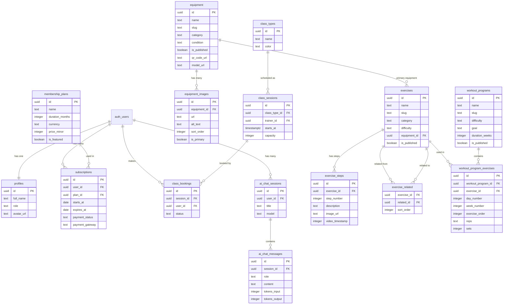
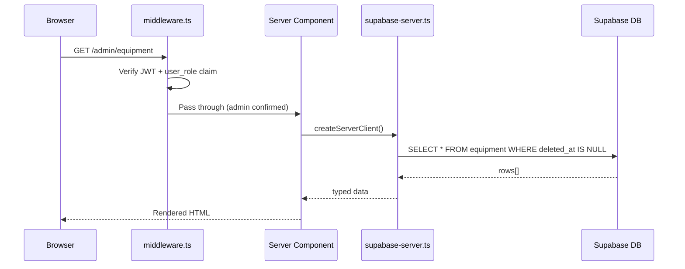
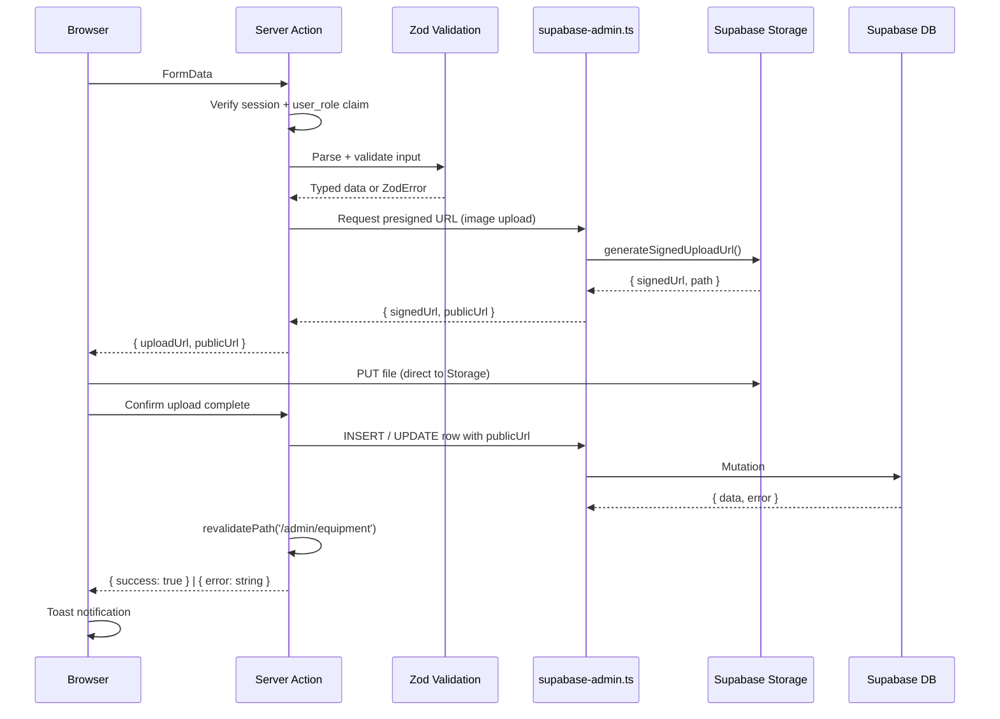
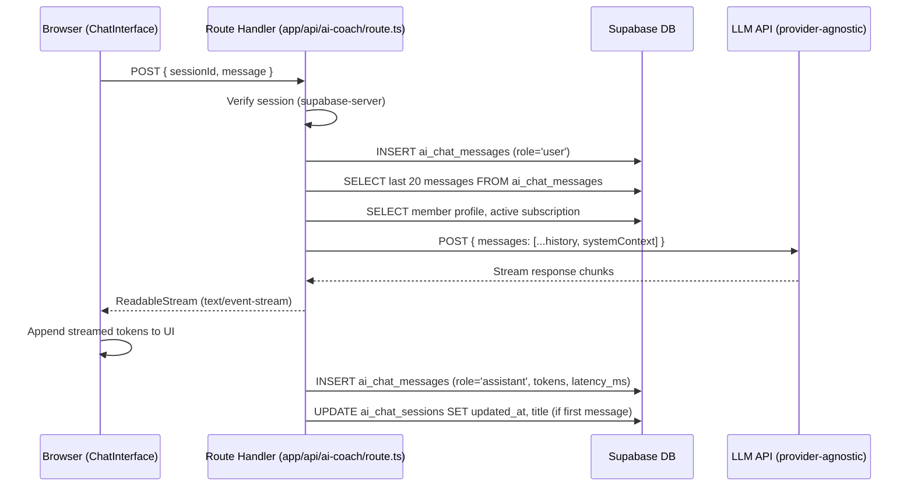

# Gym56 — Sprint 2 Revised Architecture
## Production-Ready Design for 5+ Year Scalability

> **Status:** Approved architecture — awaiting implementation approval per sprint milestone  
> **Author:** Lead Software Architect  
> **Date:** 2026-07-02  
> **Supersedes:** Sprint 2 initial architecture (verbal plan)  
> **Current codebase baseline:** Sprint 1 complete (`v0.2.0`)

---

## Table of Contents

1. [Architecture Philosophy](#1-architecture-philosophy)
2. [Updated Folder Structure](#2-updated-folder-structure)
3. [Updated Database Schema](#3-updated-database-schema)
4. [Entity Relationship Diagram](#4-entity-relationship-diagram)
5. [Table Relationships](#5-table-relationships)
6. [Indexing Strategy](#6-indexing-strategy)
7. [Storage Buckets](#7-storage-buckets)
8. [Updated Security Model](#8-updated-security-model)
9. [API & Server Action Design](#9-api--server-action-design)
10. [Updated Roadmap](#10-updated-roadmap)
11. [Additional Production Recommendations](#11-additional-production-recommendations)

---

## 1. Architecture Philosophy

### Core Principles

| Principle | Application |
|---|---|
| **Normalize aggressively** | Arrays replaced by child tables; JSONB only for truly schema-less data |
| **Server-first** | Server Components for reads; Server Actions for writes; client only where interactivity demands it |
| **Defence in depth** | Middleware → RLS → Server Action role check — three independent security layers |
| **Provider-agnostic** | No vendor lock-in on AI, payments, or storage paths |
| **Soft delete everywhere** | `deleted_at` on all content tables — no data is ever permanently lost without deliberate purge |
| **Audit trail** | `created_by` / `updated_by` on all admin-writable tables |
| **Additive migrations** | Every schema decision can be extended without breaking changes |
| **Enum discipline** | `TEXT CHECK` constraints over Postgres `ENUM` — migrations stay non-destructive |

### Three-Client Supabase Pattern

```
Browser (Client Components)
  └── lib/supabase-browser.ts     createBrowserClient()   @supabase/ssr
                                  Anon key + session cookie

Server (Server Components, generateMetadata, layouts)
  └── lib/supabase-server.ts      createServerClient()    @supabase/ssr
                                  Anon key + reads cookie

Admin Mutations (Server Actions only — never in browser bundle)
  └── lib/supabase-admin.ts       createClient()          @supabase/supabase-js
                                  service_role key — bypasses RLS
```

> **Migration note:** The existing `lib/supabase.ts` browser client will be renamed to
> `lib/supabase-browser.ts` and migrated from `@supabase/supabase-js` raw client to
> `@supabase/ssr`'s `createBrowserClient()` in Sprint 2A. This is required for correct
> cookie-based session handling in Next.js 15 App Router.

---

## 2. Updated Folder Structure

```
Gym56/Gym56/
│
├── app/
│   │
│   ├── (public)/                            # Public marketing site
│   │   ├── layout.tsx                       # Public-specific layout (if needed)
│   │   ├── page.tsx                         # Home
│   │   ├── about/page.tsx                   # Stub → Sprint 2B
│   │   ├── classes/page.tsx                 # Stub → Sprint 2D
│   │   ├── contact/page.tsx                 # Stub → Sprint 2A
│   │   ├── services/page.tsx                # Stub → Sprint 2B
│   │   ├── equipment/
│   │   │   ├── page.tsx                     # Equipment library (public)
│   │   │   └── [slug]/page.tsx              # Equipment detail + QR landing
│   │   ├── exercises/
│   │   │   ├── page.tsx                     # Exercise library
│   │   │   └── [slug]/                      # Dynamic exercise detail
│   │   │       ├── page.tsx                 # Server wrapper (generateMetadata)
│   │   │       └── ExerciseDetail.tsx       # Client component (existing)
│   │   └── programs/
│   │       ├── page.tsx                     # Workout programs library
│   │       └── [slug]/page.tsx              # Program detail
│   │
│   ├── (auth)/                              # Auth pages (redirect if logged in)
│   │   ├── layout.tsx                       # AuthLayout wrapper
│   │   ├── login/page.tsx
│   │   ├── signup/page.tsx
│   │   ├── forgot-password/page.tsx
│   │   └── reset-password/page.tsx
│   │
│   ├── (member)/                            # Authenticated member area
│   │   ├── layout.tsx                       # Redirects to /login if no session
│   │   ├── dashboard/page.tsx               # Member home: active plan, upcoming classes
│   │   ├── profile/page.tsx                 # Edit name, phone, avatar
│   │   ├── membership/page.tsx              # Plan details, expiry, history
│   │   ├── programs/
│   │   │   └── [slug]/page.tsx              # Member-specific program progress
│   │   └── ai-coach/
│   │       ├── page.tsx                     # AI Coach session list
│   │       └── [sessionId]/page.tsx         # AI Coach chat interface
│   │
│   └── (admin)/                             # Admin area (role = 'admin' required)
│       ├── layout.tsx                       # AdminShell: sidebar + header
│       └── admin/
│           ├── page.tsx                     # Dashboard: stats, recent activity
│           ├── equipment/
│           │   ├── page.tsx                 # Equipment table + search + filter
│           │   ├── new/page.tsx             # Create equipment
│           │   └── [id]/
│           │       ├── page.tsx             # Edit equipment (details, images, model)
│           │       └── qr/page.tsx          # QR code view + download
│           ├── exercises/
│           │   ├── page.tsx                 # Exercise table
│           │   ├── new/page.tsx
│           │   └── [id]/page.tsx            # Edit exercise + steps CMS
│           ├── programs/
│           │   ├── page.tsx                 # Workout programs table
│           │   ├── new/page.tsx
│           │   └── [id]/page.tsx            # Edit program + drag-and-drop exercises
│           ├── members/
│           │   ├── page.tsx                 # Member list + search
│           │   └── [id]/page.tsx            # Member detail: profile, subs, bookings
│           ├── memberships/
│           │   ├── page.tsx                 # Active subscription table
│           │   └── plans/page.tsx           # Edit plan pricing
│           ├── classes/
│           │   ├── page.tsx                 # Calendar + list view
│           │   ├── new/page.tsx
│           │   └── [id]/page.tsx
│           ├── contact/page.tsx             # Submissions inbox
│           └── analytics/page.tsx           # (Sprint 2H) Revenue + growth
│
├── components/
│   │
│   ├── ui/                                  # Shared design system primitives
│   │   ├── Button.tsx                       # variant, size, loading, asChild
│   │   ├── Input.tsx                        # Label + error + aria baked in
│   │   ├── Textarea.tsx
│   │   ├── Select.tsx
│   │   ├── Badge.tsx                        # difficulty, status, condition variants
│   │   ├── Card.tsx                         # glass + non-glass variants
│   │   ├── Modal.tsx                        # Focus trap + Escape + backdrop
│   │   ├── ConfirmDialog.tsx                # Destructive action confirmation
│   │   ├── Toast.tsx                        # Paired with useToast hook
│   │   ├── Skeleton.tsx                     # Shape-matched loading placeholder
│   │   ├── EmptyState.tsx                   # Icon + heading + optional CTA
│   │   ├── Pagination.tsx
│   │   └── Table.tsx                        # Sortable headers, loading state
│   │
│   ├── layout/                              # Site-wide layout pieces
│   │   ├── Navbar.tsx                       # (existing, moved)
│   │   └── Footer.tsx                       # (existing, moved)
│   │
│   ├── home/                                # Homepage-only sections
│   │   ├── Hero.tsx
│   │   ├── TrustedSection.tsx
│   │   ├── Features.tsx
│   │   ├── Membership.tsx
│   │   ├── Reviews.tsx
│   │   └── CTA.tsx
│   │
│   ├── auth/
│   │   └── AuthLayout.tsx                   # Shared card wrapper (eliminates 3× duplication)
│   │
│   ├── admin/
│   │   ├── AdminSidebar.tsx                 # Collapsible nav, aria-current="page"
│   │   ├── AdminHeader.tsx                  # Breadcrumb + user avatar
│   │   ├── StatCard.tsx                     # Metric tile: value + trend
│   │   ├── DataTable.tsx                    # Search + filter + pagination + bulk select
│   │   ├── ImageUploader.tsx                # Drag-drop → Supabase Storage
│   │   ├── SortableImageList.tsx            # Drag-to-reorder equipment_images
│   │   ├── SortableStepList.tsx             # Drag-to-reorder exercise_steps
│   │   └── ProgramBuilder.tsx               # Drag-and-drop exercise day planner
│   │
│   ├── equipment/
│   │   ├── EquipmentCard.tsx                # Public grid card
│   │   ├── EquipmentGrid.tsx                # Filter + search + grid
│   │   └── EquipmentForm.tsx                # Admin create/edit
│   │
│   ├── exercises/
│   │   ├── ExerciseCard.tsx                 # Extracted from existing inline JSX
│   │   ├── ExerciseFilter.tsx               # Category toggles (extracted)
│   │   └── ExerciseForm.tsx                 # Admin create/edit + step builder
│   │
│   ├── programs/
│   │   ├── ProgramCard.tsx
│   │   ├── ProgramGrid.tsx
│   │   └── ProgramDetail.tsx               # Day-by-day exercise breakdown
│   │
│   └── ai-coach/
│       ├── ChatInterface.tsx                # Message list + input
│       ├── ChatMessage.tsx                  # Single message bubble
│       └── SessionList.tsx                  # Left panel: conversation history
│
├── lib/
│   ├── supabase-browser.ts                  # createBrowserClient() — @supabase/ssr
│   ├── supabase-server.ts                   # createServerClient() — @supabase/ssr
│   ├── supabase-admin.ts                    # service_role client — server-only
│   ├── AuthContext.tsx                      # (existing — updated to use browser client)
│   ├── siteData.ts                          # (deprecated — kept as fallback during migration)
│   ├── utils.ts                             # cn(), getDifficultyColor(), slugify(), etc.
│   └── animations.ts                        # Shared Framer Motion variants
│
├── types/
│   ├── supabase.ts                          # Generated: supabase gen types typescript
│   ├── index.ts                             # App-level types + re-exports
│   └── api.ts                               # Server Action response shapes
│
├── hooks/
│   ├── useEquipment.ts
│   ├── useExercises.ts
│   ├── usePrograms.ts
│   ├── useMembers.ts
│   ├── useAICoach.ts
│   └── useToast.ts
│
├── actions/                                 # Next.js Server Actions (server-only)
│   ├── equipment.ts
│   ├── exercise-steps.ts
│   ├── exercises.ts
│   ├── programs.ts
│   ├── members.ts
│   ├── contact.ts
│   ├── membership.ts
│   ├── ai-coach.ts
│   └── qr.ts
│
├── docs/
│   ├── PROJECT_AUDIT.md                     # Sprint 1 audit
│   └── SPRINT2_ARCHITECTURE.md             # This document
│
└── middleware.ts                            # Extended with admin + member guards
```

---

## 3. Updated Database Schema

### Naming Conventions

| Convention | Rule |
|---|---|
| Table names | `snake_case`, plural |
| Column names | `snake_case` |
| Primary keys | `id UUID DEFAULT gen_random_uuid()` |
| Foreign keys | `{referenced_table_singular}_id` |
| Timestamps | `created_at TIMESTAMPTZ NOT NULL DEFAULT NOW()` |
| Soft delete | `deleted_at TIMESTAMPTZ` — `NULL` means active |
| Audit cols | `created_by UUID REFERENCES auth.users(id) ON DELETE SET NULL` |
| Booleans | `is_{adjective}` prefix |
| Ordering | `sort_order INTEGER NOT NULL DEFAULT 0` |

---

### `profiles`

Automatically created via Supabase trigger on `auth.users` insert. Never INSERT'd directly by application code.

```
profiles
────────────────────────────────────────────
id              UUID        PK, FK → auth.users(id) CASCADE DELETE
full_name       TEXT
phone           TEXT
avatar_url      TEXT        → Storage: avatars/{id}/avatar.{ext}
role            TEXT        CHECK IN ('member', 'admin', 'trainer')
                            DEFAULT 'member'
created_at      TIMESTAMPTZ NOT NULL DEFAULT NOW()
updated_at      TIMESTAMPTZ NOT NULL DEFAULT NOW()
```

**Trigger:** `moddatetime` extension keeps `updated_at` current automatically.
**Signup trigger:** `handle_new_user()` function inserts a `profiles` row on every `auth.users` insert.

---

### `membership_plans`

Admin-managed pricing tiers. Replaces hardcoded `plans` array in `Membership.tsx`.

```
membership_plans
────────────────────────────────────────────
id                UUID        PK
name              TEXT        NOT NULL                    e.g. '6 Months'
duration_months   INTEGER     NOT NULL CHECK > 0
currency          TEXT        NOT NULL DEFAULT 'INR'      ISO 4217 code
price_minor       INTEGER     NOT NULL CHECK >= 0         Amount in minor units
                                                          INR: paise (₹7000 = 700000)
savings_label     TEXT                                    e.g. 'Save ₹2000'
is_featured       BOOLEAN     NOT NULL DEFAULT FALSE
is_active         BOOLEAN     NOT NULL DEFAULT TRUE
sort_order        INTEGER     NOT NULL DEFAULT 0
created_at        TIMESTAMPTZ NOT NULL DEFAULT NOW()
updated_at        TIMESTAMPTZ NOT NULL DEFAULT NOW()
```

**Currency note:** `price_minor` stores the smallest unit of the currency (paise for INR, cents for USD). Display helpers in `lib/utils.ts` format for the UI. This is directly compatible with Razorpay, Stripe, and every other payment gateway without conversion.

---

### `subscriptions`

```
subscriptions
────────────────────────────────────────────
id                UUID        PK
user_id           UUID        NOT NULL FK → auth.users(id) CASCADE DELETE
plan_id           UUID        NOT NULL FK → membership_plans(id) RESTRICT
starts_at         DATE        NOT NULL
expires_at        DATE        NOT NULL    CHECK expires_at > starts_at
payment_status    TEXT        NOT NULL DEFAULT 'pending'
                              CHECK IN ('pending','paid','failed','refunded','cancelled')
payment_ref       TEXT                    Razorpay / Stripe payment ID
payment_gateway   TEXT                    'razorpay' | 'stripe' | 'cash' | 'manual'
amount_paid_minor INTEGER                 Actual amount charged (may differ from plan)
currency          TEXT        NOT NULL DEFAULT 'INR'
notes             TEXT                    Admin notes
created_by        UUID        FK → auth.users(id) ON DELETE SET NULL
created_at        TIMESTAMPTZ NOT NULL DEFAULT NOW()
updated_at        TIMESTAMPTZ NOT NULL DEFAULT NOW()
```

---

### `equipment`

Core CMS table. Supports full media, ordering, QR, and 3D model fields.

```
equipment
────────────────────────────────────────────
id                UUID        PK
name              TEXT        NOT NULL
slug              TEXT        NOT NULL UNIQUE
category          TEXT        NOT NULL
                  CHECK IN ('Cardio','Strength','Free Weights',
                             'Machines','Functional','Recovery','Other')
description       TEXT
quantity          INTEGER     NOT NULL DEFAULT 1 CHECK >= 0
condition         TEXT        NOT NULL DEFAULT 'good'
                  CHECK IN ('excellent','good','fair','maintenance','retired')
location          TEXT                    e.g. 'Ground Floor', 'Terrace'
is_available      BOOLEAN     NOT NULL DEFAULT TRUE
is_published      BOOLEAN     NOT NULL DEFAULT FALSE   Draft by default
sort_order        INTEGER     NOT NULL DEFAULT 0
-- Media (primary image for cards; full gallery in equipment_images)
primary_image_url TEXT                    → Storage: equipment-images/{id}/primary.{ext}
-- Future: QR
qr_code_url       TEXT                    → Storage: qr-codes/{id}/qr.png
-- Future: 3D Virtual Gym
model_url         TEXT                    → Storage: equipment-models/{id}/model.glb
model_scale       NUMERIC     DEFAULT 1.0             Scale factor for 3D scene
model_position    JSONB       DEFAULT '{"x":0,"y":0,"z":0}'  Position in virtual gym
-- Audit
created_by        UUID        FK → auth.users(id) ON DELETE SET NULL
updated_by        UUID        FK → auth.users(id) ON DELETE SET NULL
deleted_at        TIMESTAMPTZ                          Soft delete
created_at        TIMESTAMPTZ NOT NULL DEFAULT NOW()
updated_at        TIMESTAMPTZ NOT NULL DEFAULT NOW()
```

---

### `equipment_images`

Normalized image gallery. Replaces `equipment.image_urls TEXT[]`.

```
equipment_images
────────────────────────────────────────────
id                UUID        PK
equipment_id      UUID        NOT NULL FK → equipment(id) CASCADE DELETE
url               TEXT        NOT NULL    → Storage: equipment-images/{equipment_id}/{filename}
alt_text          TEXT                    SEO + accessibility
sort_order        INTEGER     NOT NULL DEFAULT 0
is_primary        BOOLEAN     NOT NULL DEFAULT FALSE
created_at        TIMESTAMPTZ NOT NULL DEFAULT NOW()
```

**Design notes:**
- `is_primary = TRUE` identifies the hero image (denormalised for fast queries; enforced by application)
- `sort_order` enables drag-and-drop reordering in the admin CMS
- When a new primary is set, a Server Action updates the old primary's flag and `equipment.primary_image_url` in a single transaction

---

### `exercises`

Moves the 7-item `siteData.ts` array to a proper table. `instructions TEXT[]` is removed.

```
exercises
────────────────────────────────────────────
id                UUID        PK
name              TEXT        NOT NULL
slug              TEXT        NOT NULL UNIQUE
category          TEXT        NOT NULL
                  CHECK IN ('Chest','Back','Shoulders','Legs',
                             'Arms','Core','Cardio')
muscle_group      TEXT
equipment_id      UUID        FK → equipment(id) ON DELETE SET NULL
equipment_label   TEXT                    Fallback text when no FK row exists
difficulty        TEXT        NOT NULL
                  CHECK IN ('Beginner','Intermediate','Advanced')
target_muscles    TEXT[]      NOT NULL DEFAULT '{}'
common_mistakes   TEXT[]      NOT NULL DEFAULT '{}'
safety_tips       TEXT[]      NOT NULL DEFAULT '{}'
-- NOTE: instructions replaced by exercise_steps table (see below)
-- Media
primary_image_url TEXT
video_url         TEXT                    Storage URL or YouTube embed ID
-- Flags
is_published      BOOLEAN     NOT NULL DEFAULT FALSE   Draft by default
sort_order        INTEGER     NOT NULL DEFAULT 0
-- Audit
created_by        UUID        FK → auth.users(id) ON DELETE SET NULL
updated_by        UUID        FK → auth.users(id) ON DELETE SET NULL
deleted_at        TIMESTAMPTZ
created_at        TIMESTAMPTZ NOT NULL DEFAULT NOW()
updated_at        TIMESTAMPTZ NOT NULL DEFAULT NOW()
```

**Note on `common_mistakes` and `safety_tips`:** These remain as `TEXT[]` because they are simple flat lists that don't benefit from normalization (no media, no ordering UI needed, small count). `instructions` is the only field being promoted to a child table because steps need per-step images, video timestamps, and QR-guided interactivity.

---

### `exercise_steps`

Replaces `exercises.instructions TEXT[]`.

```
exercise_steps
────────────────────────────────────────────
id                UUID        PK
exercise_id       UUID        NOT NULL FK → exercises(id) CASCADE DELETE
step_number       INTEGER     NOT NULL CHECK > 0
description       TEXT        NOT NULL
image_url         TEXT                    → Storage: exercise-media/{exercise_id}/step_{n}.{ext}
video_timestamp   INTEGER                 Seconds into exercise video for this step
cue               TEXT                    Short coaching cue e.g. "Keep chest up"
created_at        TIMESTAMPTZ NOT NULL DEFAULT NOW()

UNIQUE (exercise_id, step_number)
```

**Design notes:**
- `step_number` is explicit (not derived from insertion order) — safe to reorder, insert, delete
- `video_timestamp` enables the future "jump to step" feature in the video player
- `cue` is the short prompt shown in QR-guided tutorials and AI Coach responses
- Steps are fetched in `ORDER BY step_number ASC`

---

### `exercise_related`

Replaces `exercises.related_slugs TEXT[]` with a proper join table. Slug references were the root cause of the "always-empty Related Exercises" bug in Sprint 1.

```
exercise_related
────────────────────────────────────────────
exercise_id       UUID        NOT NULL FK → exercises(id) CASCADE DELETE
related_id        UUID        NOT NULL FK → exercises(id) CASCADE DELETE
sort_order        INTEGER     NOT NULL DEFAULT 0
PRIMARY KEY (exercise_id, related_id)
CHECK (exercise_id <> related_id)          No self-reference
```

---

### `workout_programs`

First-class workout plan entity.

```
workout_programs
────────────────────────────────────────────
id                    UUID        PK
name                  TEXT        NOT NULL
slug                  TEXT        NOT NULL UNIQUE
description           TEXT
difficulty            TEXT        NOT NULL
                      CHECK IN ('Beginner','Intermediate','Advanced')
goal                  TEXT        NOT NULL
                      CHECK IN ('Strength','Fat Loss','Muscle Building',
                                 'Endurance','Flexibility','General Fitness')
duration_weeks        INTEGER     NOT NULL CHECK > 0   e.g. 4, 8, 12
days_per_week         INTEGER     NOT NULL CHECK BETWEEN 1 AND 7
estimated_session_min INTEGER                          Avg. minutes per session
primary_image_url     TEXT
is_published          BOOLEAN     NOT NULL DEFAULT FALSE
is_featured           BOOLEAN     NOT NULL DEFAULT FALSE
-- Audit
created_by            UUID        FK → auth.users(id) ON DELETE SET NULL
updated_by            UUID        FK → auth.users(id) ON DELETE SET NULL
deleted_at            TIMESTAMPTZ
created_at            TIMESTAMPTZ NOT NULL DEFAULT NOW()
updated_at            TIMESTAMPTZ NOT NULL DEFAULT NOW()
```

---

### `workout_program_exercises`

Join table mapping exercises into a program with full prescription metadata.

```
workout_program_exercises
────────────────────────────────────────────
id                    UUID        PK
workout_program_id    UUID        NOT NULL FK → workout_programs(id) CASCADE DELETE
exercise_id           UUID        NOT NULL FK → exercises(id) RESTRICT
day_number            INTEGER     NOT NULL CHECK > 0      e.g. 1 = Monday, 3 = Wednesday
week_number           INTEGER     NOT NULL DEFAULT 1      For progressive programs
exercise_order        INTEGER     NOT NULL DEFAULT 0      Display order within day
sets                  INTEGER              CHECK > 0
reps                  TEXT                               e.g. '8-12', 'AMRAP', '60s'
rest_seconds          INTEGER              CHECK >= 0
weight_guidance       TEXT                               e.g. '70% 1RM', 'Bodyweight'
notes                 TEXT                               Coaching note for this slot
created_at            TIMESTAMPTZ NOT NULL DEFAULT NOW()

UNIQUE (workout_program_id, exercise_id, day_number, week_number, exercise_order)
```

**Design notes:**
- `week_number` supports progressive overload programs (Week 1: 3×10, Week 2: 4×8, etc.)
- `reps TEXT` is intentional — rep prescriptions are often ranges or time-based, not single integers
- `RESTRICT` on `exercise_id` FK prevents deleting an exercise that is part of a program

---

### `class_types`

```
class_types
────────────────────────────────────────────
id            UUID        PK
name          TEXT        NOT NULL UNIQUE
description   TEXT
color         TEXT        NOT NULL DEFAULT '#DC2626'    Hex for calendar UI
icon          TEXT                                      Lucide icon name
is_active     BOOLEAN     NOT NULL DEFAULT TRUE
created_at    TIMESTAMPTZ NOT NULL DEFAULT NOW()
updated_at    TIMESTAMPTZ NOT NULL DEFAULT NOW()
```

---

### `class_sessions`

```
class_sessions
────────────────────────────────────────────
id              UUID        PK
class_type_id   UUID        NOT NULL FK → class_types(id) CASCADE DELETE
trainer_id      UUID        FK → auth.users(id) ON DELETE SET NULL
starts_at       TIMESTAMPTZ NOT NULL
ends_at         TIMESTAMPTZ NOT NULL    CHECK ends_at > starts_at
capacity        INTEGER     NOT NULL DEFAULT 20 CHECK > 0
location        TEXT
is_cancelled    BOOLEAN     NOT NULL DEFAULT FALSE
cancel_reason   TEXT
created_by      UUID        FK → auth.users(id) ON DELETE SET NULL
created_at      TIMESTAMPTZ NOT NULL DEFAULT NOW()
updated_at      TIMESTAMPTZ NOT NULL DEFAULT NOW()
```

---

### `class_bookings`

```
class_bookings
────────────────────────────────────────────
id              UUID        PK
session_id      UUID        NOT NULL FK → class_sessions(id) CASCADE DELETE
user_id         UUID        NOT NULL FK → auth.users(id) CASCADE DELETE
status          TEXT        NOT NULL DEFAULT 'confirmed'
                CHECK IN ('confirmed','cancelled','attended','no_show')
booked_at       TIMESTAMPTZ NOT NULL DEFAULT NOW()

UNIQUE (session_id, user_id)
```

---

### `contact_submissions`

```
contact_submissions
────────────────────────────────────────────
id              UUID        PK
name            TEXT        NOT NULL
email           TEXT        NOT NULL
phone           TEXT
subject         TEXT
message         TEXT        NOT NULL
is_read         BOOLEAN     NOT NULL DEFAULT FALSE
read_by         UUID        FK → auth.users(id) ON DELETE SET NULL
read_at         TIMESTAMPTZ
replied_at      TIMESTAMPTZ
ip_address      TEXT                    Rate-limiting / spam detection (optional)
created_at      TIMESTAMPTZ NOT NULL DEFAULT NOW()
```

---

### `ai_chat_sessions`

Replaces the original `ai_coach_sessions` with JSONB messages.

```
ai_chat_sessions
────────────────────────────────────────────
id              UUID        PK
user_id         UUID        NOT NULL FK → auth.users(id) CASCADE DELETE
title           TEXT                    Auto-generated from first user message
model           TEXT        NOT NULL DEFAULT 'default'    Provider-agnostic identifier
is_archived     BOOLEAN     NOT NULL DEFAULT FALSE
created_at      TIMESTAMPTZ NOT NULL DEFAULT NOW()
updated_at      TIMESTAMPTZ NOT NULL DEFAULT NOW()
```

---

### `ai_chat_messages`

Replaces `messages JSONB` — fully normalized, pageable, analytics-ready.

```
ai_chat_messages
────────────────────────────────────────────
id              UUID        PK
session_id      UUID        NOT NULL FK → ai_chat_sessions(id) CASCADE DELETE
role            TEXT        NOT NULL CHECK IN ('system','user','assistant','tool')
content         TEXT        NOT NULL
tokens_input    INTEGER                 Token count of input for this turn
tokens_output   INTEGER                 Token count of output for this turn
model           TEXT                    Which model generated this response
latency_ms      INTEGER                 Response time (monitoring)
created_at      TIMESTAMPTZ NOT NULL DEFAULT NOW()
```

**Why this matters over JSONB:**
- Paginate thousands of messages efficiently with `LIMIT / OFFSET` or cursor pagination
- Query token usage per session, per user, per day for cost analytics
- Monitor latency per message to detect slow responses
- Filter by `role` — e.g. "show only assistant messages" for audit
- Each message is independently addressable (useful for editing, regenerating, flagging)
- Standard structure mirrors OpenAI, Anthropic, and Google AI message formats exactly

---

## 4. Entity Relationship Diagram



---

## 5. Table Relationships

| Relationship | Type | FK Behaviour | Notes |
|---|---|---|---|
| `auth.users` → `profiles` | 1:1 | CASCADE DELETE | Trigger-created |
| `auth.users` → `subscriptions` | 1:N | CASCADE DELETE | History preserved via soft audit |
| `auth.users` → `class_bookings` | 1:N | CASCADE DELETE | |
| `auth.users` → `ai_chat_sessions` | 1:N | CASCADE DELETE | |
| `membership_plans` → `subscriptions` | 1:N | **RESTRICT** | Cannot delete a plan with active subscriptions |
| `equipment` → `equipment_images` | 1:N | CASCADE DELETE | Deleting equipment removes its images |
| `equipment` → `exercises` | 1:N | SET NULL | Equipment removal doesn't delete exercises |
| `exercises` → `exercise_steps` | 1:N | CASCADE DELETE | Steps are owned by the exercise |
| `exercises` → `exercise_related` | M:N | CASCADE DELETE | Both sides cascade |
| `exercises` → `workout_program_exercises` | 1:N | **RESTRICT** | Cannot delete exercise in active program |
| `workout_programs` → `workout_program_exercises` | 1:N | CASCADE DELETE | |
| `class_types` → `class_sessions` | 1:N | CASCADE DELETE | |
| `class_sessions` → `class_bookings` | 1:N | CASCADE DELETE | Session cancel cascades to bookings |
| `ai_chat_sessions` → `ai_chat_messages` | 1:N | CASCADE DELETE | |

---

## 6. Indexing Strategy

Indexes should be created at migration time. Listed here for planning.

```sql
-- profiles
CREATE INDEX idx_profiles_role ON profiles(role);

-- subscriptions
CREATE INDEX idx_subscriptions_user_id ON subscriptions(user_id);
CREATE INDEX idx_subscriptions_plan_id ON subscriptions(plan_id);
CREATE INDEX idx_subscriptions_expires_at ON subscriptions(expires_at);
CREATE INDEX idx_subscriptions_payment_status ON subscriptions(payment_status);

-- equipment
CREATE INDEX idx_equipment_slug ON equipment(slug);
CREATE INDEX idx_equipment_category ON equipment(category);
CREATE INDEX idx_equipment_is_published ON equipment(is_published) WHERE deleted_at IS NULL;

-- equipment_images
CREATE INDEX idx_equipment_images_equipment_id ON equipment_images(equipment_id);
CREATE INDEX idx_equipment_images_sort ON equipment_images(equipment_id, sort_order);

-- exercises
CREATE INDEX idx_exercises_slug ON exercises(slug);
CREATE INDEX idx_exercises_category ON exercises(category);
CREATE INDEX idx_exercises_difficulty ON exercises(difficulty);
CREATE INDEX idx_exercises_equipment_id ON exercises(equipment_id);
CREATE INDEX idx_exercises_is_published ON exercises(is_published) WHERE deleted_at IS NULL;

-- exercise_steps
CREATE INDEX idx_exercise_steps_exercise_id ON exercise_steps(exercise_id, step_number);

-- workout_programs
CREATE INDEX idx_workout_programs_slug ON workout_programs(slug);
CREATE INDEX idx_workout_programs_goal ON workout_programs(goal);
CREATE INDEX idx_workout_programs_difficulty ON workout_programs(difficulty);

-- workout_program_exercises
CREATE INDEX idx_wpe_program_id ON workout_program_exercises(workout_program_id);
CREATE INDEX idx_wpe_exercise_id ON workout_program_exercises(exercise_id);
CREATE INDEX idx_wpe_day_week ON workout_program_exercises(workout_program_id, week_number, day_number);

-- class_sessions
CREATE INDEX idx_class_sessions_starts_at ON class_sessions(starts_at);
CREATE INDEX idx_class_sessions_class_type_id ON class_sessions(class_type_id);
CREATE INDEX idx_class_sessions_trainer_id ON class_sessions(trainer_id);

-- class_bookings
CREATE INDEX idx_class_bookings_user_id ON class_bookings(user_id);
CREATE INDEX idx_class_bookings_session_id ON class_bookings(session_id);

-- contact_submissions
CREATE INDEX idx_contact_submissions_is_read ON contact_submissions(is_read);
CREATE INDEX idx_contact_submissions_created_at ON contact_submissions(created_at DESC);

-- ai_chat_sessions
CREATE INDEX idx_ai_chat_sessions_user_id ON ai_chat_sessions(user_id);
CREATE INDEX idx_ai_chat_sessions_updated_at ON ai_chat_sessions(user_id, updated_at DESC);

-- ai_chat_messages
CREATE INDEX idx_ai_chat_messages_session_id ON ai_chat_messages(session_id, created_at ASC);
```

**Partial index note:** `WHERE deleted_at IS NULL` on `equipment` and `exercises` ensures public-facing queries only scan active records, not soft-deleted ones. This is a significant performance win as the table grows.

---

## 7. Storage Buckets

| Bucket | Access | Path Pattern | Max File Size | Allowed Types |
|---|---|---|---|---|
| `avatars` | **Private** (owner only) | `{user_id}/avatar.{ext}` | 2 MB | jpg, png, webp |
| `equipment-images` | **Public** | `{equipment_id}/{filename}` | 8 MB | jpg, png, webp |
| `exercise-media` | **Public** | `{exercise_id}/{type}/{filename}` | 500 MB (video) | jpg, png, webp, mp4, mov |
| `equipment-models` | **Public** | `{equipment_id}/model.glb` | 50 MB | glb, gltf |
| `qr-codes` | **Public** | `{equipment_id}/qr.png` | 512 KB | png |
| `program-images` | **Public** | `{program_id}/cover.{ext}` | 8 MB | jpg, png, webp |

### Storage RLS Policies

```
avatars bucket:
  SELECT  → authenticated users reading their own folder (path starts with auth.uid())
  INSERT  → authenticated users inserting into their own folder
  UPDATE  → authenticated users updating their own files
  DELETE  → authenticated users deleting their own files

equipment-images bucket:
  SELECT  → public (anonymous allowed)
  INSERT  → admin role only (via Server Action using service_role client)
  UPDATE  → admin role only
  DELETE  → admin role only

exercise-media, equipment-models, qr-codes, program-images:
  SELECT  → public
  INSERT / UPDATE / DELETE → admin role only (via service_role in Server Actions)
```

> **Important:** All admin storage writes go through Server Actions using `supabase-admin.ts` (service role). No admin Storage credentials are ever sent to the browser. The browser uploads to a presigned URL generated by the Server Action, which then records the final path in the database.

### Presigned Upload Flow

```
1. Browser: user selects file in ImageUploader component
2. Browser → Server Action: requests presigned upload URL (filename, size, type)
3. Server Action: validates admin role, generates presigned URL via service_role client
4. Server Action → Browser: returns { uploadUrl, publicUrl }
5. Browser: PUT file directly to Supabase Storage using presigned URL
6. Browser → Server Action: confirms upload, sends publicUrl
7. Server Action: records URL in database (equipment_images, etc.)
```

This keeps bandwidth off the Next.js server and never exposes service role credentials.

---

## 8. Updated Security Model

### Middleware Layer (Edge — First Line)

```
Every request
  └── middleware.ts
        ├── Reads sb-*-auth-token cookie
        ├── Decodes session (JWT verification via @supabase/ssr)
        │
        ├── /admin/* 
        │     └── No session → redirect /login?redirectTo=/admin
        │     └── Session exists → fetch profile.role
        │           └── role !== 'admin' → redirect / (403-style)
        │           └── role === 'admin' → pass through
        │
        ├── /(member)/*
        │     └── No session → redirect /login?redirectTo={pathname}
        │     └── Session exists → pass through
        │
        ├── /(auth)/*
        │     └── Session exists → redirect /dashboard
        │     └── No session → pass through
        │
        └── All else → pass through (public)
```

**Note:** The `profiles.role` check in middleware requires a DB query. To avoid this latency on every admin request, the role should be embedded in the Supabase JWT custom claims via a `custom_access_token_hook` (Supabase Auth Hook). This makes the role readable directly from the JWT in middleware without a DB round-trip.

```sql
-- Supabase Auth Hook (set in Supabase dashboard under Auth → Hooks)
-- Adds { "user_role": "admin" } to the JWT access token claims
CREATE OR REPLACE FUNCTION public.custom_access_token_hook(event JSONB)
RETURNS JSONB AS $$
DECLARE
  claims JSONB;
  user_role TEXT;
BEGIN
  SELECT role INTO user_role FROM public.profiles WHERE id = (event->>'user_id')::UUID;
  claims := event->'claims';
  claims := jsonb_set(claims, '{user_role}', to_jsonb(COALESCE(user_role, 'member')));
  RETURN jsonb_set(event, '{claims}', claims);
END;
$$ LANGUAGE plpgsql STABLE SECURITY DEFINER;
```

Middleware then reads `session.user.user_metadata.user_role` — zero DB queries.

### RLS Layer (Second Line — Database)

Full RLS policy table:

| Table | Anon SELECT | Auth SELECT | Auth INSERT | Auth UPDATE | Auth DELETE | Admin ALL |
|---|---|---|---|---|---|---|
| `profiles` | ❌ | Own row only | ❌ (trigger) | Own row only | ❌ | ✅ |
| `membership_plans` | ✅ active only | ✅ | ❌ | ❌ | ❌ | ✅ |
| `subscriptions` | ❌ | Own rows | ❌ | ❌ | ❌ | ✅ |
| `equipment` | ✅ published only | ✅ published | ❌ | ❌ | ❌ | ✅ |
| `equipment_images` | ✅ | ✅ | ❌ | ❌ | ❌ | ✅ |
| `exercises` | ✅ published only | ✅ published | ❌ | ❌ | ❌ | ✅ |
| `exercise_steps` | ✅ | ✅ | ❌ | ❌ | ❌ | ✅ |
| `exercise_related` | ✅ | ✅ | ❌ | ❌ | ❌ | ✅ |
| `workout_programs` | ✅ published only | ✅ published | ❌ | ❌ | ❌ | ✅ |
| `workout_program_exercises` | ✅ | ✅ | ❌ | ❌ | ❌ | ✅ |
| `class_types` | ✅ | ✅ | ❌ | ❌ | ❌ | ✅ |
| `class_sessions` | ✅ | ✅ | ❌ | ❌ | ❌ | ✅ |
| `class_bookings` | ❌ | Own rows | Own rows | Own rows | Own rows | ✅ |
| `contact_submissions` | ❌ | ❌ | ✅ (anon) | ❌ | ❌ | ✅ |
| `ai_chat_sessions` | ❌ | Own rows | Own rows | Own rows | Own rows | ✅ |
| `ai_chat_messages` | ❌ | Via session ownership | Via session | ❌ | ❌ | ✅ |

**Admin policy template (applied to every table):**
```sql
-- Admin bypass: reads role from JWT claim (no DB query)
CREATE POLICY "Admins have full access"
  ON public.{table}
  FOR ALL
  USING (
    (auth.jwt() ->> 'user_role') = 'admin'
  )
  WITH CHECK (
    (auth.jwt() ->> 'user_role') = 'admin'
  );
```

**Soft-delete filter on public tables:**
```sql
-- Equipment: anon can only see published, non-deleted rows
CREATE POLICY "Public can view published equipment"
  ON public.equipment
  FOR SELECT
  TO anon, authenticated
  USING (is_published = TRUE AND deleted_at IS NULL);
```

### Server Action Layer (Third Line — Application)

Every Server Action independently verifies the caller before executing. This is defence-in-depth — if middleware is bypassed and RLS is misconfigured, the action layer still blocks.

```
Server Action pattern:
  1. createServerClient() → get current user from session cookie
  2. If no user → throw 'Unauthenticated'
  3. Read user_role from JWT claims (no DB query needed)
  4. If role !== 'admin' → throw 'Forbidden'
  5. Validate all input with Zod schema
  6. Use supabase-admin.ts (service role) for the mutation
  7. Call revalidatePath() to invalidate Next.js cache
  8. Return typed { data } | { error } response
```

### Environment Variables

```bash
# Existing — public (safe to expose to browser)
NEXT_PUBLIC_SUPABASE_URL=
NEXT_PUBLIC_SUPABASE_ANON_KEY=

# New — server-only (never prefix with NEXT_PUBLIC_)
SUPABASE_SERVICE_ROLE_KEY=

# AI Coach — provider-agnostic naming
LLM_API_KEY=                    # Works for OpenAI, Anthropic, Google, Groq, etc.
LLM_BASE_URL=                   # e.g. https://api.openai.com/v1 (swappable)
LLM_MODEL=                      # e.g. gpt-4o, claude-3-5-sonnet, gemini-2.0-flash

# Future — payments
RAZORPAY_KEY_ID=
RAZORPAY_KEY_SECRET=

# Future — QR generation
QR_BASE_URL=                    # Base URL for QR content (e.g. https://gym56.vercel.app)
```

---

## 9. API & Server Action Design

### Read Pattern: Server Component → Supabase



### Write Pattern: Server Action → Supabase



### Input Validation with Zod

Every Server Action uses a Zod schema. The schema lives in `types/api.ts` and is shared between the Server Action (server-side validation) and the form component (client-side pre-validation).

```
types/api.ts exports:
  EquipmentCreateSchema
  EquipmentUpdateSchema
  ExerciseCreateSchema
  ExerciseStepSchema
  ProgramCreateSchema
  ProgramExerciseSchema
  MemberUpdateSchema
  ContactSubmissionSchema
  AIChatMessageSchema
```

### AI Coach API Flow (Sprint 2E)



**Why a Route Handler instead of a Server Action for AI?**
Server Actions don't support streaming responses. The AI coach requires streaming for a good UX (tokens appear progressively). Route Handlers (`app/api/`) support `ReadableStream` natively.

---

## 10. Updated Roadmap

### Sprint 2A — Admin Foundation + Equipment CMS
**Goal:** Admin can log in, access the dashboard, and manage equipment.

- [ ] Migrate `lib/supabase.ts` → `lib/supabase-browser.ts` using `@supabase/ssr`
- [ ] Create `lib/supabase-server.ts` and `lib/supabase-admin.ts`
- [ ] Create `types/supabase.ts` via `supabase gen types typescript`
- [ ] Create `lib/utils.ts` — `cn()`, `getDifficultyColor()`, `slugify()`, `formatCurrency()`
- [ ] Create `components/ui/` — Button, Input, Badge, Card, Toast, Modal, Skeleton, EmptyState, Table
- [ ] Create `components/auth/AuthLayout.tsx` — eliminate 3× auth page duplication
- [ ] DB: `profiles`, `membership_plans`, `equipment`, `equipment_images` tables + RLS
- [ ] DB: `profiles` auto-create trigger
- [ ] DB: JWT custom claims hook for `user_role`
- [ ] Extend `middleware.ts` — admin role check using JWT claim
- [ ] `(admin)` layout — `AdminSidebar`, `AdminHeader`
- [ ] `/admin` dashboard page — stat cards (members, equipment count, active subscriptions)
- [ ] `/admin/equipment` — DataTable with search, filter, pagination
- [ ] `/admin/equipment/new` + `/admin/equipment/[id]` — CRUD with `ImageUploader`
- [ ] `actions/equipment.ts` — create, update, soft-delete, toggle publish
- [ ] Storage: `equipment-images` bucket + policies
- [ ] Migrate `siteData.ts` plans array → `membership_plans` table
- [ ] `/admin/memberships/plans` — edit pricing
- [ ] Public `/equipment` page — equipment grid + filter
- [ ] Public `/equipment/[slug]` — equipment detail page
- [ ] Fix public `Membership.tsx` to read from DB instead of `siteData.ts`

---

### Sprint 2B — Member Dashboard + Profiles
**Goal:** Members can view their membership status and edit their profile.

- [ ] DB: `subscriptions` table + RLS
- [ ] `(member)` layout — auth guard, member nav
- [ ] `/dashboard` — active plan widget, days remaining, upcoming classes placeholder
- [ ] `/profile` — edit full_name, phone; avatar upload to `avatars` bucket
- [ ] `/membership` — current plan detail, history table
- [ ] `actions/members.ts` — update profile, update avatar
- [ ] Storage: `avatars` bucket + owner-only policies
- [ ] Navbar: add Profile and Dashboard links for logged-in members
- [ ] `/admin/members` — member list + search
- [ ] `/admin/members/[id]` — member detail + manual subscription assignment
- [ ] `/admin/memberships` — active subscriptions table with expiry alerts

---

### Sprint 2C — Workout Programs + Exercise Steps
**Goal:** Admin can build full workout programs. Exercise instructions become rich, step-by-step content.

- [ ] DB: `exercises`, `exercise_steps`, `exercise_related`, `workout_programs`, `workout_program_exercises` + RLS
- [ ] Migrate `siteData.ts` exercises → `exercises` + `exercise_steps` tables
- [ ] `actions/exercises.ts` — CRUD + publish toggle
- [ ] `actions/exercise-steps.ts` — create, reorder, update, delete steps
- [ ] `actions/programs.ts` — CRUD + publish
- [ ] `/admin/exercises` — exercise table
- [ ] `/admin/exercises/[id]` — edit exercise + `SortableStepList` for steps
- [ ] `/admin/programs` — program table
- [ ] `/admin/programs/[id]` — `ProgramBuilder` drag-and-drop day planner
- [ ] Update public `/exercises` + `/exercise/[slug]` to read from DB
- [ ] Extract `ExerciseCard` and `ExerciseFilter` into `components/exercises/`
- [ ] Public `/programs` — program library grid
- [ ] Public `/programs/[slug]` — program detail with day-by-day breakdown
- [ ] `ExerciseDetail` fix: use `exercise_related` join table (fixes the "always empty" bug)
- [ ] Storage: `exercise-media` + `program-images` buckets

---

### Sprint 2D — Classes
**Goal:** Members can browse and book gym classes.

- [ ] DB: `class_types`, `class_sessions`, `class_bookings` + RLS
- [ ] `actions/membership.ts` — booking availability check (capacity guard)
- [ ] `/admin/classes` — schedule calendar + list view
- [ ] `/admin/classes/new` + `/admin/classes/[id]`
- [ ] Public `/classes` — schedule view with booking CTA
- [ ] Member booking flow — book, cancel, status tracking
- [ ] `/dashboard` update — show upcoming booked classes

---

### Sprint 2E — AI Coach
**Goal:** Members can have context-aware AI conversations about workouts and gym.

- [ ] DB: `ai_chat_sessions`, `ai_chat_messages` + RLS
- [ ] `app/api/ai-coach/route.ts` — streaming Route Handler
- [ ] `actions/ai-coach.ts` — create session, archive session, update title
- [ ] `components/ai-coach/` — `ChatInterface`, `ChatMessage`, `SessionList`
- [ ] `/ai-coach` — session list + new chat
- [ ] `/ai-coach/[sessionId]` — full chat interface with streaming
- [ ] System prompt: inject member profile, active plan, program, booked classes
- [ ] Connect to exercise and equipment DB for context-aware answers
- [ ] `/admin/analytics` — token usage per day (reads from `ai_chat_messages`)

---

### Sprint 2F — QR Code System
**Goal:** Every piece of equipment has a scannable QR code linking to its public page.

- [ ] `actions/qr.ts` — generate QR PNG, upload to `qr-codes` bucket, save URL
- [ ] Storage: `qr-codes` bucket + policies
- [ ] QR generation triggered on equipment create/update in `actions/equipment.ts`
- [ ] `/admin/equipment/[id]/qr` — preview + download QR code
- [ ] Public `/equipment/[slug]` — QR landing page (mobile-optimised)
- [ ] Optional: step-by-step QR walkthrough using `exercise_steps.cue` field

---

### Sprint 2G — 3D Virtual Gym
**Goal:** Members can explore the gym in a 3D environment and click equipment to learn about it.

- [ ] Storage: `equipment-models` bucket + policies
- [ ] `/admin/equipment/[id]` — add 3D model upload section (`model_url`, `model_scale`, `model_position`)
- [ ] `actions/equipment.ts` — handle GLB upload to `equipment-models`
- [ ] `/virtual-gym` — React Three Fiber scene
- [ ] Load all `equipment` rows with `model_url IS NOT NULL`
- [ ] Place models using `model_position` JSON from DB
- [ ] Click interaction → `EquipmentCard` overlay
- [ ] "View exercises" from equipment → filtered `/exercises?equipment={slug}`

---

### Sprint 2H — Payments + Analytics
**Goal:** Members can purchase memberships online. Admin has revenue visibility.

- [ ] Razorpay integration — `RAZORPAY_KEY_ID`, `RAZORPAY_KEY_SECRET`
- [ ] `/api/payment/create-order` — Route Handler creates Razorpay order
- [ ] `/api/payment/verify` — Route Handler verifies webhook signature
- [ ] On payment success: insert `subscriptions` row with `payment_status='paid'`
- [ ] `subscriptions.payment_gateway`, `payment_ref`, `amount_paid_minor` populated
- [ ] Member `/membership` — "Buy/Renew" button with Razorpay modal
- [ ] `/admin/analytics` — revenue chart, member growth, plan distribution

---

## 11. Additional Production Recommendations

### Database

#### REC-DB-01 — Enable `moddatetime` Extension
Apply `updated_at` automation to all mutable tables:
```sql
CREATE EXTENSION IF NOT EXISTS moddatetime;
CREATE TRIGGER handle_updated_at BEFORE UPDATE ON public.{table}
  FOR EACH ROW EXECUTE PROCEDURE moddatetime(updated_at);
```
This must be applied to: `profiles`, `membership_plans`, `subscriptions`, `equipment`, `exercises`, `workout_programs`, `class_types`, `class_sessions`, `ai_chat_sessions`.

#### REC-DB-02 — Active Subscription View
Create a DB view for the common query "does this user have an active subscription?":
```sql
CREATE VIEW public.active_subscriptions AS
  SELECT * FROM public.subscriptions
  WHERE payment_status = 'paid'
    AND starts_at <= CURRENT_DATE
    AND expires_at >= CURRENT_DATE;
```
With RLS policies applied to the view. Avoids repeating the date-range filter in every query.

#### REC-DB-03 — Capacity Check for Class Bookings
Enforce class capacity at the database level, not just application level:
```sql
CREATE OR REPLACE FUNCTION check_session_capacity()
RETURNS TRIGGER AS $$
BEGIN
  IF (
    SELECT COUNT(*) FROM public.class_bookings
    WHERE session_id = NEW.session_id AND status = 'confirmed'
  ) >= (
    SELECT capacity FROM public.class_sessions WHERE id = NEW.session_id
  ) THEN
    RAISE EXCEPTION 'Class session is at full capacity';
  END IF;
  RETURN NEW;
END;
$$ LANGUAGE plpgsql;

CREATE TRIGGER enforce_class_capacity
  BEFORE INSERT ON public.class_bookings
  FOR EACH ROW EXECUTE FUNCTION check_session_capacity();
```

#### REC-DB-04 — `pgvector` Extension (Future — AI)
Reserve a column in `exercises` and `equipment` for vector embeddings:
```sql
-- Do not add yet — add when pgvector is enabled in Sprint 2E
-- ALTER TABLE exercises ADD COLUMN embedding vector(1536);
-- CREATE INDEX ON exercises USING ivfflat (embedding vector_cosine_ops);
```
This enables semantic search ("exercises similar to squats") and RAG for the AI Coach.

#### REC-DB-05 — Slug Generation Uniqueness
Slugs must be unique. When the admin creates an exercise named "Chest Press" and one already exists, append a number suffix (`chest-press-2`). Enforce this in the Server Action + DB `UNIQUE` constraint.

### Security

#### REC-SEC-01 — Input Validation with Zod (Non-Optional)
Every Server Action input must be validated with Zod before touching the database. The schema must be defined in `types/api.ts` and imported by both the Server Action (runtime) and the form component (pre-validation). No raw `FormData.get()` without parsing.

#### REC-SEC-02 — Rate Limiting on Contact Form
The `contact_submissions` table allows anonymous inserts. Without rate limiting, it can be spammed. Add rate limiting at the middleware or Route Handler level using Vercel's `@vercel/kv` or Upstash Redis.

#### REC-SEC-03 — Image Upload Validation
`ImageUploader` must validate file type and size **before** requesting a presigned URL. The Server Action must also validate the MIME type server-side (don't trust the client's Content-Type header). Accept only `image/jpeg`, `image/png`, `image/webp`.

#### REC-SEC-04 — Supabase Auth Email Templates
Customise Supabase Auth email templates in the dashboard (Confirm signup, Reset password) to use Gym56 branding. Default Supabase templates look unprofessional and may fail spam filters.

#### REC-SEC-05 — Add Security Headers to `next.config.ts`
Currently empty. Before Sprint 2A ships, add:
```ts
headers: async () => [{
  source: '/(.*)',
  headers: [
    { key: 'X-Frame-Options', value: 'DENY' },
    { key: 'X-Content-Type-Options', value: 'nosniff' },
    { key: 'Referrer-Policy', value: 'strict-origin-when-cross-origin' },
    { key: 'Permissions-Policy', value: 'camera=(), microphone=(), geolocation=()' },
  ]
}]
```

### Performance

#### REC-PERF-01 — Supabase Connection Pooling
Use Supabase's connection pooler (PgBouncer) URL for the server client in production. The direct connection URL is for migrations only. Set via `SUPABASE_DB_URL` (pooler) vs `SUPABASE_DIRECT_URL` (migrations).

#### REC-PERF-02 — Next.js Cache Strategy per Route
| Route | Strategy | Reason |
|---|---|---|
| `/` | `revalidate: 3600` | Changes rarely |
| `/exercises` | `revalidate: 900` | Moderate change frequency |
| `/exercise/[slug]` | `generateStaticParams` + `revalidate: 3600` | Static content |
| `/equipment` | `revalidate: 900` | |
| `/programs` | `revalidate: 3600` | |
| `/admin/*` | `no-store` | Always fresh |
| `/dashboard` | `no-store` | User-specific |

#### REC-PERF-03 — Optimistic UI for Admin CMS
Admin CRUD actions should use React's `useOptimistic` hook to update the UI immediately while the Server Action runs in the background. Reverting on error with a Toast notification. This makes the admin feel instant.

#### REC-PERF-04 — Image CDN
Supabase Storage URLs are served from the Supabase CDN. Configure `next.config.ts` to allow the Supabase storage hostname in `images.remotePatterns` and use `<Image>` from `next/image` everywhere. This provides automatic WebP conversion, responsive `srcSet`, and lazy loading.

### Code Quality

#### REC-CODE-01 — `lib/utils.ts` Functions to Define
The following utilities are needed across the project and must be centralised:
- `cn(...classes)` — conditional Tailwind class merging (use `clsx` + `tailwind-merge`)
- `getDifficultyColor(difficulty)` — remove the 2× duplication
- `slugify(text)` — consistent slug generation for equipment, exercises, programs
- `formatCurrency(minor, currency)` — display ₹7000 from `700000, 'INR'`
- `formatDate(timestamptz)` — consistent date display across the app
- `getInitials(name)` — for avatar fallback display

#### REC-CODE-02 — Tailwind `accent` Color Token
`#DC2626` appears 40+ times as an arbitrary value. Must be added to `tailwind.config.ts` as `accent` before Sprint 2A begins, so all new components use `bg-accent` / `text-accent` from the start.

#### REC-CODE-03 — Add `clsx` and `tailwind-merge`
Required for `cn()` utility. These are standard in every modern Next.js project:
```json
"clsx": "^2.1.1",
"tailwind-merge": "^2.5.4"
```

#### REC-CODE-04 — Add Zod
Required for Server Action input validation:
```json
"zod": "^3.23.8"
```

#### REC-CODE-05 — Add `@supabase/ssr`
Required to replace the current browser-only client with cookie-aware SSR-compatible clients:
```json
"@supabase/ssr": "^0.5.2"
```

### Testing Strategy (Post-Sprint 2A)

Once the DB layer exists, a testing baseline should be established:

| Layer | Tool | Scope |
|---|---|---|
| Unit | Vitest | `lib/utils.ts`, Zod schemas, currency formatters |
| Component | React Testing Library | UI components, form validation |
| Integration | Vitest + Supabase local | Server Actions against local Supabase |
| E2E | Playwright | Auth flow, admin CRUD, member booking |

Add to `package.json` in Sprint 2A:
```json
"vitest": "^2.x",
"@testing-library/react": "^16.x",
"@playwright/test": "^1.x"
```

---

## Architecture Decision Log

| Decision | Rationale | Alternative Considered |
|---|---|---|
| `TEXT[]` kept for `common_mistakes`, `safety_tips` | Flat lists, no media, no ordering needed, small count | Separate tables (over-normalised for the use case) |
| `reps TEXT` in `workout_program_exercises` | Reps can be "8-12", "AMRAP", "60s", "To failure" | `INTEGER` (too restrictive) |
| Route Handlers for AI streaming, Server Actions for everything else | Server Actions don't support streaming | Server Actions only (would break AI UX) |
| `TEXT CHECK` over Postgres `ENUM` | Non-destructive migrations; easier to add values | `ENUM` (requires `ALTER TYPE` on every change) |
| JWT custom claim for `user_role` | Zero DB query in middleware for role check | Middleware DB query on every request (too slow) |
| Presigned URLs for storage uploads | Admin credentials never in browser bundle | Direct client upload with anon key (insecure for admin-only buckets) |
| `LLM_API_KEY` + `LLM_BASE_URL` + `LLM_MODEL` | Swap providers by changing env vars, zero code changes | `OPENAI_API_KEY` hardcoded (locks to one provider) |
| Soft delete (`deleted_at`) on content tables | Audit trail, accidental deletion recovery | Hard delete (irreversible) |
| `week_number` in `workout_program_exercises` | Supports progressive overload over multiple weeks | Single flat list (can't represent periodised programs) |

---

*End of Sprint 2 Architecture Document*  
*Awaiting approval to begin Sprint 2A implementation.*
